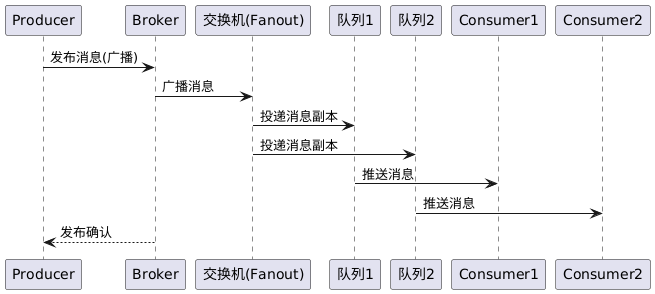

# 系统设计说明书

## 系统设计

为更直观地展示系统功能和设计，实现对前文需求的模型化，本文提供关键的 UML 图，包括用例图、类图、顺序图和部署图。这些图分别描述系统的功能角色交互、模块组成关系、各功能流程动态交互以及系统的物理部署结构。

###  类图

下图为系统核心模块和类之间关系的类图。类图展示Broker服务器内部的主要组件及数据模型，包括连接和信道管理、虚拟主机及其下的交换机、队列、绑定关系，以及消息与消费者等。各类之间的关联（如组合、聚合、关联关系）表明了系统的静态结构。

上述类图描述了 Broker 服务端的分层结构：

* **BrokerServer（Broker服务器）**：作为顶层控制类，持有VirtualHost（虚拟主机）、Connection（连接）等主要组件。它通过组合关系包含一个VirtualHost实例来管理所有交换机、队列等数据；同时包含多个Connection，用于追踪客户端连接。BrokerServer启动时会初始化这些组件并开始监听网络。
* **Connection（连接）**：表示一个客户端与Broker的TCP连接，会话期间BrokerServer维护多个活动连接。每个Connection组合了多个Channel（信道），即一个连接可打开多个独立的通信信道。Connection提供打开/关闭信道的方法。
* **Channel（信道）**：信道封装了一系列协议操作，如basicPublish（发送消息）、basicConsume（订阅消息）等。Channel通过依赖关系使用VirtualHost来访问交换机和队列资源（例如发布消息时需要调用VirtualHost的basicPublish逻辑）。Channel也可以与Consumer关联：如果该信道被用于订阅队列，则其上会注册一个Consumer回调。
* **VirtualHost（虚拟主机）**：作为Broker内部逻辑命名空间，包含并管理多个Exchange（交换机）、Queue（队列）及Binding（绑定关系）。VirtualHost提供接口方法用于声明/删除交换机和队列、绑定/解绑、以及基本消息发布、消费等操作。这些方法通常会调用内部的管理器来完成实际逻辑。在类图中，VirtualHost通过组合关系包含多个Exchange和Queue对象集合。
* **Exchange（交换机）**：表示交换机实体，具有名称、类型（ExchangeType 枚举，包括Direct/Fanout/Topic等）以及是否持久化等属性。在实现中，Exchange不会直接保存绑定列表，而是通过Binding类与Queue关联。类图中Exchange与Binding是多对多关系的一端，表示一个交换机可以有多个绑定。
* **Queue（队列）**：表示消息队列，具有名称和持久化等属性。Queue通过组合关系包含消息列表（Message）表示队列当前存储的消息。同时Queue可以与多个Binding关联，表示多个交换机可能绑定此队列。队列也通过关联关系连接Consumer，表示当前订阅该队列的消费者集合（一个队列可被多个消费者订阅进行负载均衡）。
* **Binding（绑定关系）**：作为连接Exchange和Queue的关联类，包含绑定键这一属性。一个Binding实例表示“交换机<->队列”的一个绑定，Binding上的绑定键定义了消息从该交换机流向该队列所需匹配的路由键规则。在类图中，用两条关联线表示Binding分别连接Exchange和Queue。
* **Message（消息）**：表示队列中的单条消息，包含消息ID、内容等基本信息。实际实现中消息属性（BasicProperties）也包括持久化标志、路由键等，在类图中为简洁仅列出主要字段。Queue和Message是组合关系，即消息作为队列的组成元素，队列销毁时其消息也随之销毁。
* **Consumer（消费者）**：表示一个订阅者实例，包含消费者标识（标签）和自动确认标志等属性。一个Consumer通过订阅某队列而产生，Queue到Consumer的关联表示一个队列可以有多个消费者订阅。Channel在订阅操作时会创建Consumer并与之关联。若Consumer断开或取消订阅，则Broker会移除该Consumer。

总的来说，该类图体现出系统模块划分明确：BrokerServer负责网络层和整体协调，VirtualHost管理核心消息模型（交换机/队列），Connection/Channel处理会话逻辑，Consumer/Message表示具体运行时实体。各模块之间关系清晰，如BrokerServer->VirtualHost->Queue->Message这一条组合链说明消息从产生到存储的归属关系，而Connection->Channel->Consumer链说明消息从网络连接到具体消费者处理的关系。这样的设计便于扩展和维护，例如可以轻松增加新的Exchange类型或修改持久化实现，而不影响其他模块。

###  顺序图

以下顺序图分别针对系统的12项功能场景，描述各参与对象（客户端、Broker组件等）之间消息传递与方法调用的时序流程。

**1 消息发送**
此顺序图展示了生产者客户端将消息发送到Broker并存入目标队列的过程。参与者包括生产者（Producer）、Broker服务器（Broker）和目标队列。生产者调用发送操作，Broker接收消息进行路由和存储，最后返回发送结果给生产者。

步骤解析：Producer通过网络向Broker发送消息内容和路由信息，Broker找到对应Queue并将消息写入内存队列（若队列持久化则同时写磁盘）。完成后Broker向Producer返回一个确认（以虚线表示应答）。该流程体现了消息从发送端到达Broker再进入存储队列的简单路径。

**2 消息接收**
此顺序图展示消费者订阅队列并接收消息的过程。消费者向Broker发出订阅请求，Broker确认并建立订阅，然后当有消息到达队列时，Broker将消息推送给消费者。

流程说明：Consumer请求订阅Queue Q，Broker处理后返回确认（Consumer现在开始监听Q）。当Q中产生新消息时，Broker主动发送该消息给Consumer。此处用分隔线标注消息到达的异步时机。消费者收到消息后即可进行处理（本图未显示ACK，见后续**消息确认**顺序图）。

**3 队列管理**
下图涵盖队列的创建和删除两个操作的顺序。管理员请求Broker声明一个新队列，Broker创建队列并响应成功。随后管理员请求删除该队列，Broker执行删除流程并确认。

说明：管理员首先发送“声明队列”请求，包含队列参数，Broker创建队列资源并回复成功。接着（假设稍后）管理员发送“删除队列”请求，Broker移除该队列并回复删除成功。两个操作相互独立，在顺序图中按先后顺序展示。Broker内部在创建时可能与元数据存储、消费者管理等交互，在此简化未展开。

**4 消息持久化**
该顺序图显示发送持久化消息时Broker写入磁盘的过程。Producer发送一条需要持久化的消息，Broker除了写入队列内存外，还将消息保存到磁盘文件，然后确认发送成功。

过程描述：Producer发送消息并标记为需要持久化，Broker收到后将消息内容写入本地Storage（磁盘文件）。当写入完成，Broker才向Producer发送确认，表示消息已安全存储并进入队列。Storage代表Broker本地的持久化介质（文件系统）。这一过程保障Broker故障重启后消息仍可从Storage恢复。

**5 消息确认**
下图展现消费者对已收到消息进行ACK确认的过程。Consumer发送确认请求，Broker将对应消息从队列删除并回应确认完成。

步骤说明：Consumer向Broker发送ACK，注明队列和消息ID。Broker查找Queue中该消息并将其删除（若持久化则标记无效）。然后Broker返回一个ACK处理成功的响应给Consumer。此后，该消息不会再出现。这里Queue对象用于表示Broker在相应队列中执行删除操作。

**6 死信队列**
该顺序图表示当消费者拒绝消息导致消息进入死信队列的过程。Broker将消息投递给Consumer，Consumer由于处理失败发送拒绝（NACK），Broker据此将消息路由到预设的死信队列。

流程解析：Broker将消息发送给Consumer -> Consumer因无法处理发送NACK拒绝 -> Broker收到NACK后，不再将此消息返回原队列，而是将其作为死信消息投入DLQ（死信队列）。最后Broker回复Consumer已处理其拒绝操作。注释说明Consumer可能因失败或超时未确认，这两种情况均可触发死信流程。在当前设计中，死信路由需要DLQ已绑定，Broker才能执行最后一步投递。

**7 客户端连接管理**
下图描述客户端与Broker建立连接、打开/关闭信道以及断开连接的过程。Client代表生产者或消费者客户端。Broker维护连接和信道，并在会话结束时释放资源。

说明：Client开始与Broker进行TCP握手建立连接，Broker接受后通知成功。然后Client通过该连接发送打开信道请求，Broker创建信道（ID=1）并确认成功打开。随后Client可以正常进行消息收发（未在此图体现），当结束时Client请求关闭信道，Broker关闭该信道并确认。最后Client断开整个连接，Broker也确认连接关闭。分隔块划分了连接建立、信道管理、断开三个阶段。Broker内部在这些阶段会创建Connection和Channel对象并管理其生命周期。

**8 简单路由**
该顺序图展示Direct类型交换机的消息路由流程。Producer发布消息到Direct交换机，Broker根据路由键找到匹配的队列，并将消息递交队列，然后回复Producer发送完成。

过程：Producer请求Broker将消息发布到某Direct Exchange，附路由键“X”。Broker查Exchange绑定，找到绑定键等于“X”的Queue，然后将消息交付该Queue。最后Broker通知Producer发布成功。Exchange在此图中明确参与路由决策，Queue接收消息。如果没有匹配Queue，则Broker会跳过投递直接反馈Producer失败（未在图中画出else情况）。

**9 管理接口**
下图刻画管理员查询Broker状态的过程。Admin发送查询请求，Broker分别从内部的交换机、队列、绑定管理模块获取数据，然后将结果汇总返回。

说明：Admin触发`svrstat`查询，Broker顺序调用Exchange Manager、Queue Manager、Binding Manager来收集所有交换机、队列和绑定数据。收集完成后Broker将综合信息通过BasicQueryResponse发送给Admin。Admin最终获得包含所有资源列表和关系的状态报告。这里ExM/QuM/BiM表示Broker内部管理这些实体的模块或子系统。

**10 发布/订阅**
此顺序图展示Fanout交换机下发布/订阅模式的消息流。Producer将消息发布到Fanout Exchange，Broker将消息复制投递到所有绑定的队列，各队列的消费者均收到消息。

过程描述：Producer将消息发布至Fanout类型交换机，Broker从Exchange获取绑定队列列表（假设有Q1和Q2），并将消息分别发送到Q1和Q2。因为Q1有Consumer1订阅，Q2有Consumer2订阅，所以Broker进一步从各队列将消息推送给相应消费者。Producer端最后收到一次成功确认。这样Consumer1和Consumer2都各得到了该消息的副本，实现了一次发布、多方接收。

**11 消息过滤**
下图描绘Topic交换机的主题过滤场景。Producer发布消息时给定路由键，Broker让Exchange逐一匹配绑定键，消息发送到匹配的队列，而未匹配的队列不接收。

说明：Producer发送消息到Topic Exchange，路由键为"app.error.db"。Broker让Exchange对比队列A和队列B的绑定键：队列A绑定`*.error.#`可以匹配"app.error.db"，因此Exchange将消息投递到QA；队列B绑定`*.info.#`不匹配当前路由键，因此不向QB投递，图中以备注形式标明未投递。最后Broker向Producer确认消息发布成功（至少投递给了一部分队列）。Consumer若订阅了队列A将收到消息，而订阅队列B的不会收到。这体现了主题过滤按条件路由的效果。

**12 集群模式**
下图展示在两节点集群下消息发布和消费的跨节点交互。Producer连接到主节点Broker1发送消息，Broker1将消息复制同步到从节点Broker2。Consumer连接Broker2订阅队列，Broker2收到同步消息后推送给Consumer。Consumer确认后，通过Broker2通知Broker1删除消息。

流程解析：首先Consumer在节点B2上订阅Queue X（假设Queue X存在于集群，各节点同步创建），B2确认订阅。然后Producer在节点B1发布一条消息到Queue X，B1将消息保存自己队列后，通过集群通信立即同步给节点B2（B2将消息插入自己的Queue X）。同步完成后，B1向Producer返回发送成功。此时节点B2检测到Queue X有新消息且Consumer已订阅，遂将消息推送给Consumer。Consumer处理完发送ACK给B2，B2收到后本地删除消息，并将ACK通知主节点B1，触发B1也删除自己的该消息以及通知其他节点（本例无其他节点）。这样，消息在整个集群中被移除，消费完成。该顺序图展示了集群主从协作的关键步骤：消息复制和ACK回传删除。通过此流程，集群确保无论Producer和Consumer连接在哪个节点，消息都能成功传递并保证一次消费。

### 部署图

最后的部署图描述系统在物理层面的布置结构。假设一个典型的集群部署场景，其中包含两个Broker服务器节点以及生产者和消费者客户端。每个Broker节点有本地磁盘用于持久化消息，它们之间通过网络连接组成集群。生产者和消费者通过网络与各自连接的Broker节点通信。

部署图说明：

* **生产者客户端 (Prod)** 和 **消费者客户端 (Cons)** 代表不同的应用或服务，它们可能运行在不同的主机，通过网络与Broker集群通信。
* **Broker节点A** 和 **Broker节点B** 是部署在两个服务器上的Broker实例。节点A被配置为主节点（Master），节点B为从节点（Slave）。它们之间通过集群协议互联（图中“A --> B: 消息同步”表示主节点将消息复制到从节点，“A <-> B: 确认/控制”表示两者之间还有ACK确认和心跳控制等交互）。
* 每个Broker节点都连接一个本地**消息存储**（StoreA和StoreB），以数据库符号表示实际上的文件存储。Broker将持久化消息写入本地存储，实现节点内的数据保存。
* 生产者客户端通过网络将消息发送给Broker节点A；消费者客户端通过网络从Broker节点B订阅并接收消息。由于集群同步，消费者即使连到从节点B，也能收到在主节点A发布的消息。
* 部署图还显示了Broker节点之间的集群通信链接，以及Broker与本地存储的连接（表明持久化发生在本地磁盘）。
* 如有更多节点，可以类似扩展。此图体现的是双节点主从模式；在无集群的简单部署下，则只有一个Broker节点，生产者和消费者都连接该节点，本地存储提供持久化。

通过该部署结构，系统能够实现高可用：当主节点A出现故障时，可由从节点B接管（需要额外的主节点选举机制，这里未画出）。生产者和消费者可以根据配置连接到不同节点，从而分担负载。整个部署满足消息队列系统的运行要求，包括网络、存储和多实例协调。
