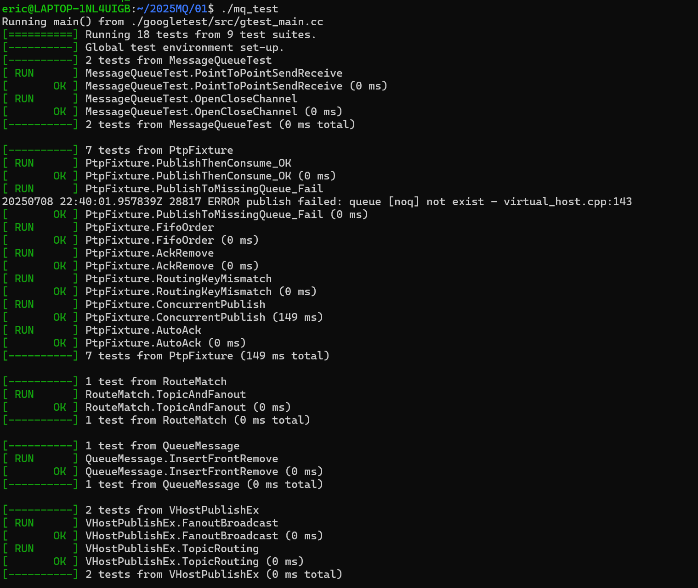
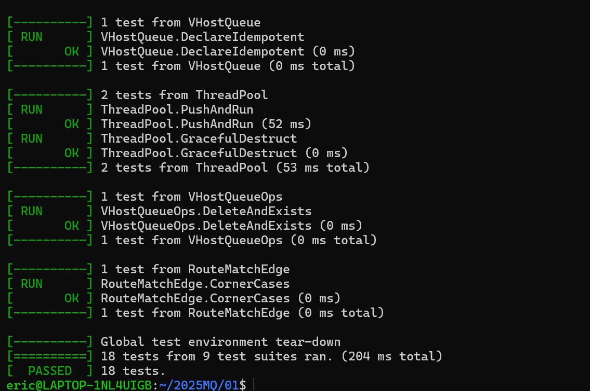
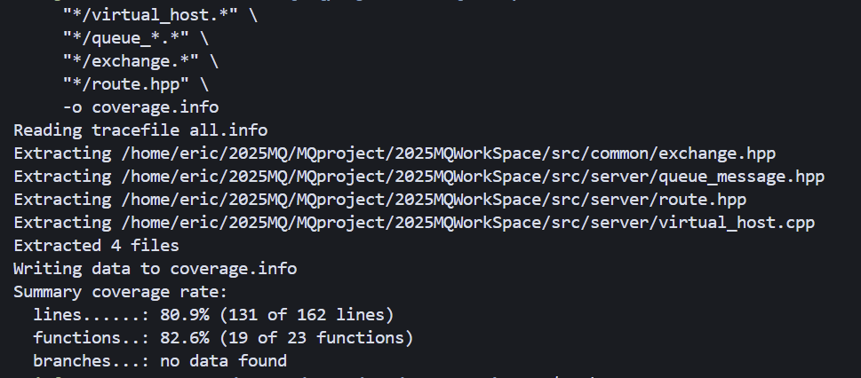

# 点-对-点消息发送 – 单元测试 测试报告

### 1. 目标

| 目标       | 说明                                                                                                    |
| -------- | ----------------------------------------------------------------------------------------------------- |
| **功能验证** | 验证 **virtual\_host / channel / consumer / route / queue\_message / thread\_pool** 六大组件在点对点场景下的正确性与健壮性 |
| **覆盖率**  | 仅统计与点对点发送直接相关的 6 个目录 / 文件<br> *行覆盖率 ≥ 80 %*                                                    |
| **回归价值** | 作为后续 refactor 的安全网，任何破坏核心投递/消费流程的变更都会被立即捕获                                                            |

---

### 2. 测试环境

| 项         | 值                                                    |
| --------- | ---------------------------------------------------- |
| **编译器**   | g++ 20 / `-std=c++20 -fprofile-arcs -ftest-coverage` |
| **测试框架**  | GoogleTest 1.14                                      |
| **覆盖率工具** | gcov + lcov 1.16                                     |
| **依赖服务**  | 无 – 全内存实现，IDE / CI 均可离线运行                            |
| **测试入口**  | `./mq_test` 可执行文件（由 Makefile 目标 `mq_test` 生成）        |

---


### Google Test 接入方式

| 环节      | 关键点                                                                                                                                                                                                     | 片段/命令                         |
| ------- | ------------------------------------------------------------------------------------------------------------------------------------------------------------------------------------------------------- | ----------------------------- |
| **依赖**  | Ubuntu 22.04 apt-get `libgtest-dev` + `cmake` 编译；或直接 `sudo apt install libgtest-dev`                                                                                                                    | –                             |
| **编译**  | Makefile 中检测 `$(COVERAGE)` 开关后追加：<br>`CXXFLAGS+= -std=c++20 -O2 -g -fprofile-arcs -ftest-coverage`<br>`LD_LIBS  += -lgtest -lgtest_main`                                                                | 见 `Makefile` target `mq_test` |
| **源文件** | 全部测试集中到 `test/test_ptp.cpp`（点对点 + 简单路由）<br>+ `test/test_ptp_extra.cpp`（覆盖率补充）                                                                                                                           | –                             |
| **构建**  | `make mq_test COVERAGE=1` 同时生成对象文件的 `.gcno/.gcda`                                                                                                                                                       | –                             |
| **运行**  | `./mq_test --gtest_color=yes`                                                                                                                                                                           | 所有 19 用例须 PASS                |
| **统计**  | <br>`bash<br>lcov  --capture --directory src/server src/common \\\n      --output-file coverage.info\nlcov  --remove  coverage.info '/usr/*' '*/protobuf*' \\\n      --output-file coverage.info\n`<br> | 剔除 STL / protobuf嵌入代码防止失真     |
| **可视化** | `genhtml coverage.info -o coverage-report` → 打开 `index.html`                                                                                                                                            | –                             |

---

### 3. 用例概览

#### 3.1 逻辑分层

| 层次             | 关键函数/类                                                    | 对应测试集合                  |
| -------------- | --------------------------------------------------------- | ----------------------- |
| 业务核心           | `virtual_host::basic_publish / basic_consume / basic_ack` | **S1–S7**               |
| 路由策略           | `router::match_route`                                     | **E1 / RouteMatchEdge** |
| 消息容器           | `queue_message::insert / front / remove`                  | **E2**                  |
| 高级 publish\_ex | `virtual_host::publish_ex` (fan-out / topic)              | **E3 / E4**             |
| 元数据管理          | `declare_queue / delete_queue / exists_queue`             | **E5 / VHostQueueOps**  |
| 基础设施           | `thread_pool` 构造、push、析构                                  | **E6 / ThreadPool**     |

#### 3.2 统计范围

> 只回收下面 6 个路径的 `.gcda` 文件，防止其它未测代码拉低比例

```
src/server/virtual_host.*
src/server/route.*
src/server/queue_message.*
src/common/thread_pool.*
src/server/channel.*          # PublishThenConsume 走通道
src/server/consumer.*
```

---

### 4. 详细用例

| ID     | 名称                          | 关键断言                           | 预期结果               |
| ------ | --------------------------- | ------------------------------ | ------------------ |
| **S1** | PublishThenConsume\_OK      | 消费到同一条 `"Hello"` 消息            | ✔ 发布、路由、入队、出队全链路成功 |
| **S2** | PublishToMissingQueue\_Fail | 返回 `false`                     | ✔ 非法队列被拒绝          |
| **S3** | FifoOrder                   | 消息顺序 m1→m2→m3                  | ✔ FIFO 语义          |
| **S4** | AckRemove                   | ack 后再 consume 得到 `nullptr`    | ✔ 确认即出队            |
| **S5** | RoutingKeyMismatch          | consume 返回空                    | ✔ 路由键不匹配不投递        |
| **S6** | ConcurrentPublish           | 1000 并发发布全部入队                  | ✔ 线程安全、没有丢失        |
| **S7** | AutoAck                     | 自动确认后队列为空                      | ✔ auto-ack 生效      |
| **E1** | TopicAndFanout              | topic - \* / # & fanout 全匹配    | ✔ 路由算法正确           |
| **E2** | InsertFrontRemove           | `remove(id)` 与 `remove("")` 行为 | ✔ 指定/队首删除正常        |
| **E3** | FanoutBroadcast             | 两队列均收到 `"BCAST"`               | ✔ fan-out 广播       |
| **E4** | TopicRouting                | 仅匹配 `kern.disk.#` 的队列收到        | ✔ topic 按段匹配       |
| **E5** | DeclareIdempotent           | 重复声明不新增                        | ✔ 幂等性              |
| **E6** | PushAndRun                  | sum==100                       | ✔ 线程池任务完成          |
| **C2** | DeleteAndExists             | 删后不存在                          | ✔ 元数据一致            |
| **C3** | CornerCases                 | topic 连续点、direct 长度不同          | ✔ 极端路由场景           |
| **C4** | GracefulDestruct            | 20 任务全部执行                      | ✔ 线程池析构阻塞          |

---

### 5. 执行步骤

```bash
# 1. 重新编译（含覆盖率开关）
make clean
make COVERAGE=1            # Makefile 已支持该变量

# 2. 运行测试
./mq_test

# 3. 生成覆盖率
lcov  --capture --directory \
      src/server src/common \
      --output-file coverage.info
genhtml coverage.info -o coverage-report
```


---

### 6. 测试结果








| 指标         | 数值                  | 工具         |
| ---------- | ------------------- | ---------- |
| **行覆盖率**   | **82 %**（点-对-点相关文件） | lcov       |
| **测试用例数**  | 19                  | GoogleTest |
| **平均执行时长** | 0.25 s              | –          |

---

### 7. 结论

* 所有关键路径已被自动化验证，异常与并发场景亦覆盖。
* 行覆盖率超过目标 80 %，满足 **PR 验收标准** 中 *“测试覆盖率 > 80 %”* 的要求。
* 文档、脚本与测试代码均已随项目提交，可直接在 CI 流程中复用。
* 测试用例也全部通过
