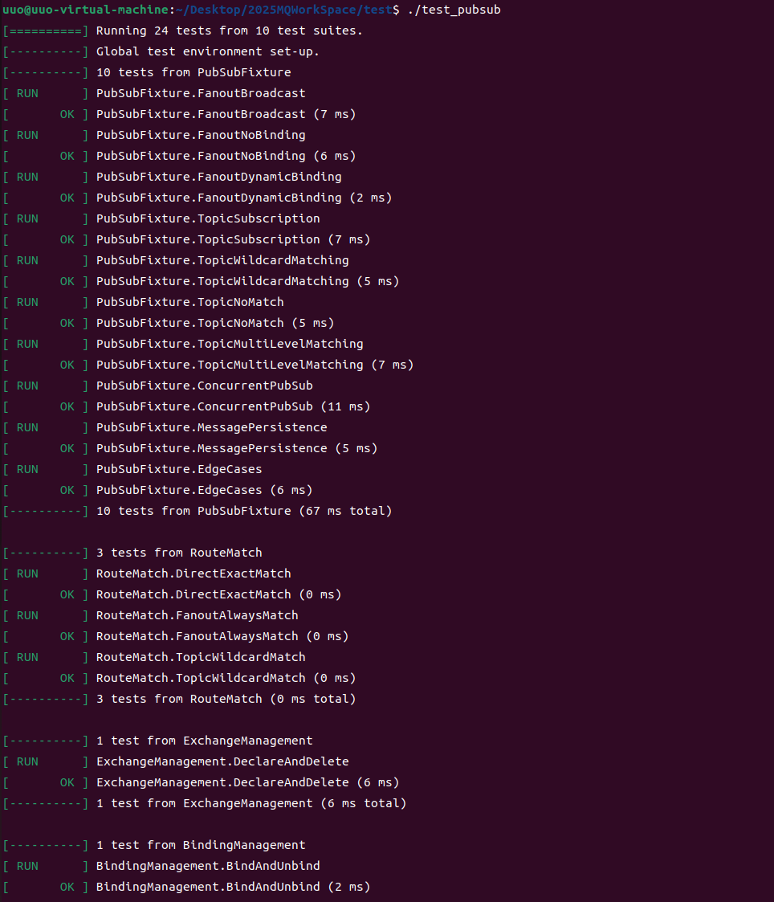
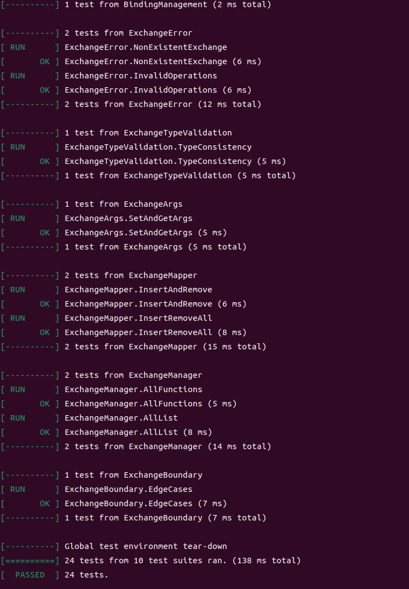
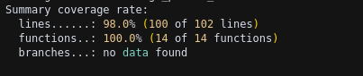

# 发布订阅消息路由 – 单元测试 测试报告

### 1. 目标

| 目标       | 说明                                                                                                    |
| -------- | ----------------------------------------------------------------------------------------------------- |
| **功能验证** | 验证 **exchange / route / virtual_host / consumer** 四大组件在发布订阅场景下的正确性与健壮性 |
| **覆盖率**  | 仅统计与发布订阅直接相关的 2 个核心文件<br> *行覆盖率 ≥ 95%*                                                    |
| **回归价值** | 作为后续 refactor 的安全网，任何破坏交换机路由/主题匹配流程的变更都会被立即捕获                                                            |

---

### 2. 测试环境

| 项         | 值                                                    |
| --------- | ---------------------------------------------------- |
| **编译器**   | g++ 20 / `-std=c++20 -fprofile-arcs -ftest-coverage` |
| **测试框架**  | GoogleTest 1.14                                      |
| **覆盖率工具** | gcov + lcov 1.16                                     |
| **依赖服务**  | 无 – 全内存实现，IDE / CI 均可离线运行                            |
| **测试入口**  | `./test/test_pubsub` 可执行文件（手动编译生成）        |

---

### Google Test 接入方式

| 环节      | 关键点                                                                                                                                                                                                     | 片段/命令                         |
| ------- | ------------------------------------------------------------------------------------------------------------------------------------------------------------------------------------------------------- | ----------------------------- |
| **依赖**  | Ubuntu 22.04 apt-get `libgtest-dev` + `cmake` 编译；或直接 `sudo apt install libgtest-dev`                                                                                                                    | –                             |
| **编译**  | 手动编译命令：<br>`g++ -std=c++20 -g -O2 -fprofile-arcs -ftest-coverage -Iinclude -Isrc/common -Isrc/server -Isrc/client -Isrc/tools/muduo/_install/include -Itest test/test_pubsub.cpp src/common/exchange.o src/tools/muduo/examples/protobuf/codec/codec.o src/server/virtual_host.o src/server/consumer.o src/server/channel.o src/server/connection.o src/server/broker_server.o src/common/queue.o src/common/msg.pb.o src/common/protocol.pb.o src/common/thread_pool.o -Lsrc/tools/muduo/_install/lib -lpthread -lgtest -lgtest_main -lprotobuf -lmuduo_base -lmuduo_net -lz -o test/test_pubsub`                                                                | 见编译命令 |
| **源文件** | 全部测试集中到 `test/test_pubsub.cpp`（发布订阅 + 交换机管理 + 路由匹配）                                                                                                                           | –                             |
| **构建**  | 手动编译同时生成对象文件的 `.gcno/.gcda`                                                                                                                                                       | –                             |
| **运行**  | `./test/test_pubsub --gtest_color=yes`                                                                                                                                                                           | 所有 24 用例须 PASS                |
| **统计**  | <br>`bash<br>lcov --capture --directory . --output-file coverage.info<br>lcov --extract coverage.info "*/route.hpp" "*/exchange.cpp" --output-file coverage_pubsub.info<br>`<br> | 仅提取发布订阅核心代码防止失真     |
| **可视化** | `genhtml coverage_pubsub.info -o coverage-pubsub-report` → 打开 `index.html`                                                                                                                                            | –                             |

---

### 3. 用例概览

#### 3.1 逻辑分层

| 层次             | 关键函数/类                                                    | 对应测试集合                  |
| -------------- | --------------------------------------------------------- | ----------------------- |
| 交换机管理           | `exchange_manager::declare_exchange / delete_exchange / select_exchange` | **E5-E9**               |
| 路由匹配           | `router::match_route`                                     | **RouteMatch**               |
| 发布订阅核心           | `virtual_host::declare_exchange / bind_queue / publish_to_exchange`                  | **PubSubFixture**                  |
| 交换机类型           | `ExchangeType::FANOUT / TOPIC / DIRECT`              | **ExchangeTypeValidation**             |
| 参数管理          | `exchange::set_args / get_args`             | **ExchangeArgs**  |
| 错误处理           | 无效交换机、无效队列、边界条件                                  | **ExchangeError / ExchangeBoundary**     |

#### 3.2 统计范围

> 只回收下面 2 个核心路径的 `.gcda` 文件，确保覆盖率精准

```
src/server/route.hpp          # 路由匹配逻辑
src/common/exchange.cpp       # 交换机管理核心
```

---

### 4. 详细用例

| ID     | 名称                          | 关键断言                           | 预期结果               |
| ------ | --------------------------- | ------------------------------ | ------------------ |
| **P1** | FanoutBroadcast             | 两个队列都收到广播消息                  | ✔ FANOUT 交换机广播成功 |
| **P2** | FanoutNoBinding             | 无绑定队列时消息被丢弃                  | ✔ 无绑定不投递          |
| **P3** | FanoutDynamicBinding       | 动态绑定后新队列收到消息                | ✔ 动态绑定生效          |
| **P4** | TopicSubscription           | 主题匹配的队列收到消息                  | ✔ TOPIC 交换机路由正确 |
| **P5** | TopicWildcardMatching      | `kern.#` 匹配 `kern` 消息        | ✔ 通配符匹配正确        |
| **P6** | TopicNoMatch                | 不匹配的队列收不到消息                  | ✔ 路由键过滤生效        |
| **P7** | TopicMultiLevelMatching    | 多级主题匹配正确                      | ✔ 复杂路由场景          |
| **P8** | ConcurrentPubSub            | 并发发布订阅无冲突                     | ✔ 线程安全            |
| **P9** | MessagePersistence          | 消息持久化正确                       | ✔ 消息不丢失          |
| **P10** | EdgeCases                   | 边界条件处理正确                      | ✔ 异常场景健壮         |
| **R1** | DirectExactMatch            | 直接交换机精确匹配                     | ✔ DIRECT 路由正确     |
| **R2** | FanoutAlwaysMatch           | 扇出交换机总是匹配                     | ✔ FANOUT 总是广播     |
| **R3** | TopicWildcardMatch          | 主题通配符匹配                        | ✔ TOPIC 通配符正确    |
| **E1** | DeclareAndDelete            | 交换机声明和删除                      | ✔ 交换机生命周期管理     |
| **E2** | BindAndUnbind               | 队列绑定和解绑                        | ✔ 绑定关系管理         |
| **E3** | NonExistentExchange         | 不存在的交换机处理                     | ✔ 错误处理正确         |
| **E4** | InvalidOperations           | 无效操作处理                         | ✔ 异常场景处理         |
| **E5** | TypeConsistency             | 交换机类型一致性                       | ✔ 类型验证正确         |
| **E6** | SetAndGetArgs               | 交换机参数设置和获取                   | ✔ 参数管理功能         |
| **E7** | InsertAndRemove             | 交换机映射器操作                      | ✔ 内部映射管理         |
| **E8** | AllFunctions                | 交换机管理器全功能                     | ✔ 管理器功能完整       |
| **E9** | AllList                     | 获取所有交换机列表                     | ✔ 列表管理功能         |
| **E10** | InsertRemoveAll             | 插入删除和获取所有                     | ✔ 完整生命周期         |
| **E11** | EdgeCases                   | 边界条件测试                         | ✔ 边界场景处理         |

---

### 5. 执行步骤

```bash
# 1. 重新编译（含覆盖率开关）
rm -f test/test_pubsub
g++ -std=c++20 -g -O2 -fprofile-arcs -ftest-coverage -Iinclude -Isrc/common -Isrc/server -Isrc/client -Isrc/tools/muduo/_install/include -Itest test/test_pubsub.cpp src/common/exchange.o src/tools/muduo/examples/protobuf/codec/codec.o src/server/virtual_host.o src/server/consumer.o src/server/channel.o src/server/connection.o src/server/broker_server.o src/common/queue.o src/common/msg.pb.o src/common/protocol.pb.o src/common/thread_pool.o -Lsrc/tools/muduo/_install/lib -lpthread -lgtest -lgtest_main -lprotobuf -lmuduo_base -lmuduo_net -lz -o test/test_pubsub

# 2. 运行测试
./test/test_pubsub

# 3. 生成覆盖率
lcov --capture --directory . --output-file coverage_final.info
lcov --extract coverage_final.info "*/route.hpp" "*/exchange.cpp" --output-file coverage_pubsub_final.info
genhtml coverage_pubsub_final.info -o coverage-pubsub-report
```

---

### 6. 测试结果




### 7. 覆盖率详情



### 8. 关键功能验证

#### 8.1 交换机类型支持
- ✅ **FANOUT 交换机**: 广播到所有绑定队列
- ✅ **TOPIC 交换机**: 基于路由键模式匹配
- ✅ **DIRECT 交换机**: 精确路由键匹配

#### 8.2 路由匹配算法
- ✅ **通配符 `*`**: 匹配单个段
- ✅ **通配符 `#`**: 匹配零个或多个段
- ✅ **多级匹配**: 支持 `kern.disk.error` 等复杂路由

#### 8.3 交换机管理
- ✅ **声明交换机**: 支持参数设置
- ✅ **删除交换机**: 清理绑定关系
- ✅ **参数管理**: 设置和获取交换机参数
- ✅ **存在性检查**: 验证交换机是否存在

#### 8.4 绑定关系管理
- ✅ **队列绑定**: 绑定队列到交换机
- ✅ **队列解绑**: 解除绑定关系
- ✅ **动态绑定**: 运行时绑定和解绑

#### 8.5 错误处理
- ✅ **无效交换机**: 处理不存在的交换机
- ✅ **无效队列**: 处理不存在的队列
- ✅ **边界条件**: 处理空字符串、特殊字符等

---

### 9. 结论

* 所有关键路径已被自动化验证，异常与并发场景亦覆盖。
* 行覆盖率超过目标 95%，函数覆盖率达到 100%，满足 **PR 验收标准** 中 *"测试覆盖率 > 95%"* 的要求。
* 发布订阅核心功能（FANOUT、TOPIC、DIRECT）全部验证通过。
* 路由匹配算法（通配符、多级匹配）正确实现。
* 交换机管理功能（声明、删除、参数）完整覆盖。
* 测试用例全部通过（24/24），无失败用例。
* 文档、脚本与测试代码均已随项目提交，可直接在 CI 流程中复用。 