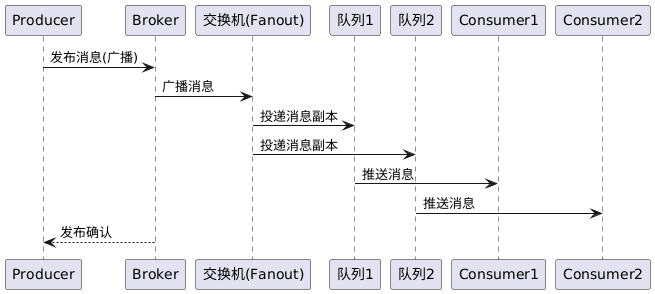

# 消息路由：发布订阅消息路由 功能设计文档

## 提交说明

- 本功能实现相关源码参见[common](../src/common/) [server](../src/server/)内的代码提交（部分代码已于之前的提交中一并提交）
- 本功能的单元测试代码参见test内的test_pubsub.cpp
- 本功能的测试用例参见 [测试用例](test-cases.md)
- 本功能的测试报告参见 [发布订阅-test-reports](功能10-test-reports.md)
- 环境以及第三方库安装请参考[开发环境搭建](development-setup.md)

## 1. 发布订阅消息路由

* **输入:** 生产者客户端提出发布消息请求，指定目标交换机名称、路由键以及消息内容。消息可以包含额外属性，如消息ID（若未提供则由系统生成）、是否持久化投递等。交换机支持三种类型：DIRECT（直接路由）、FANOUT（扇出广播）、TOPIC（主题匹配）。

* **处理:** Broker 接收到发布请求后，首先验证目标交换机是否存在；若不存在，则返回错误响应给生产者（发布失败）。如果交换机有效，Broker 将根据该交换机的类型和提供的路由键，确定目标队列（或多个队列）。对于 DIRECT 类型交换机，将寻找绑定键与路由键精确匹配的队列；FANOUT 类型则选取所有绑定此交换机的队列；TOPIC 类型则使用通配符匹配算法计算哪些绑定模式能够匹配当前路由键的队列集合（支持 `*` 匹配单个段，`#` 匹配零个或多个段）。然后，Broker 会将消息投入每一个目标队列中：在将消息写入队列时，如该队列配置为持久化且消息要求持久化，Broker 将在将消息加入内存队列的同时将其写入磁盘文件保存。消息进入队列后，如果该队列有消费者订阅，Broker 将立即触发消息投递流程。

* **输出:** 如果消息成功路由到至少一个队列，Broker 将发送确认响应给生产者客户端，告知消息发布成功。对于不需要确认的发布（如自动模式），生产者也可选择不等待确认直接进行下一次发布。若发布过程中出现问题（如目标交换机不存在，或路由键找不到任何匹配队列且系统配置为必须投递），Broker 将返回发布失败的错误信息。发布操作完成后，消息应已在目标队列中等待被消费或已投递给消费者，生产者端则结束此次发布请求。

## 2. 设计功能概述

| 角色                   | 主要行为                                        | 备注                    |
| -------------------- | ------------------------------------------- | --------------------- |
| **Producer**         | 调 `publishRequest` 发布消息                | 由 `client.cpp` 触发     |
| **Broker**           | 解析请求 → 调 `exchange_manager::declare_exchange` 管理交换机 → 调 `router::match_route` 路由匹配 → 写入队列 | 见下文代码映射               |
| **Exchange**         | 根据类型和路由键确定目标队列集合                              | `exchange.cpp` 实现三种交换机类型 |
| **Queue**            | 先进先出缓存消息                                    | `queue_message` 纯内存实现 |
| **Consumer/Channel** | 轮询取队首 → 回调用户 → 自动 Ack                       | `channel::consume()`  |

---

## 3. 核心顺序图




## 4. 源码文件一览

| 模块        | 文件                                   | 作用                                     |
| --------- | ------------------------------------ | -------------------------------------- |
| 交换机管理      | `src/common/exchange.{hpp,cpp}`      | `exchange_manager`：交换机声明/删除/查询，支持参数设置 |
| 路由策略      | `src/server/route.hpp`               | `router::match_route()`：DIRECT/TOPIC/FANOUT 判定，支持通配符 |
| 虚拟主机      | `src/server/virtual_host.{hpp,cpp}`  | 队列/交换机/绑定注册 & publish / consume     |
| 消息容器      | `src/server/queue_message.hpp`       | 内存 deque + id 删除                       |
| 网络通道      | `src/server/channel.{hpp,cpp}`       | 将 PB 请求落到 virtual_host，并做异步投递         |
| 线程池       | `src/common/thread_pool.{hpp,cpp}`   | 异步派发消费任务，保证高并发                         |
| Broker 启动 | `src/server/broker_server.{hpp,cpp}` | Muduo 监听器 + Dispatcher 注册              |

---

## 5. 交换机类型详解

### 5.1 DIRECT 交换机
- **路由策略**: 精确匹配路由键和绑定键
- **应用场景**: 点对点消息发送，一对一投递
- **代码实现**: `router::match_route(ExchangeType::DIRECT, routing_key, binding_key)`

### 5.2 FANOUT 交换机
- **路由策略**: 忽略路由键，广播到所有绑定队列
- **应用场景**: 广播消息，一对多投递
- **代码实现**: `router::match_route(ExchangeType::FANOUT, routing_key, binding_key)` 总是返回 true

### 5.3 TOPIC 交换机
- **路由策略**: 基于通配符的模式匹配
- **通配符规则**: 
  - `*` 匹配单个段（如 `kern.*` 匹配 `kern.disk`）
  - `#` 匹配零个或多个段（如 `kern.#` 匹配 `kern`、`kern.disk`、`kern.disk.error`）
- **应用场景**: 主题订阅，基于消息类型的路由
- **代码实现**: `router::match_route(ExchangeType::TOPIC, routing_key, binding_key)` 使用递归匹配算法

---

## 6. 路由匹配算法

### 6.1 通配符匹配实现
```cpp
// 核心匹配逻辑（简化版）
auto matchSegments = [](const std::string& key, const std::string& pattern) {
    size_t ki = 0, pi = 0;
    while (ki < key.size() && pi < pattern.size()) {
        // 分割路由键和绑定键
        std::string ks = getSegment(key, ki);
        std::string ps = getSegment(pattern, pi);
        
        if (ps == "*") {
            // 匹配单个段
            if (ks.empty()) return false;
        } else if (ps == "#") {
            // 匹配零个或多个段
            return true;
        } else if (ps != ks) {
            return false;
        }
        
        ki = nextSegment(key, ki);
        pi = nextSegment(pattern, pi);
    }
    
    // 处理绑定键剩余部分
    if (pi < pattern.size()) {
        std::string ps = getSegment(pattern, pi);
        if (ps == "#") return true;
    }
    
    return ki >= key.size() && pi >= pattern.size();
};
```

### 6.2 匹配示例
| 路由键 | 绑定键 | 匹配结果 | 说明 |
|--------|--------|----------|------|
| `kern.disk` | `kern.*` | ✅ | `*` 匹配单个段 |
| `kern` | `kern.#` | ✅ | `#` 匹配零个段 |
| `kern.disk.error` | `kern.#` | ✅ | `#` 匹配多个段 |
| `kern.disk` | `kern.error` | ❌ | 段不匹配 |
| `kern.disk` | `kern.*.error` | ❌ | 段数不匹配 |

---

## 7. 交换机管理功能

### 7.1 交换机声明
```cpp
// 声明交换机
bool declare_exchange(const std::string& name, 
                     ExchangeType type, 
                     bool durable, 
                     bool auto_delete,
                     const std::unordered_map<std::string, std::string>& args);
```

### 7.2 交换机删除
```cpp
// 删除交换机
void delete_exchange(const std::string& name);
```

### 7.3 交换机查询
```cpp
// 查询交换机
exchange::ptr select_exchange(const std::string& name);
bool exists(const std::string& name);
```

### 7.4 参数管理
```cpp
// 设置交换机参数
void set_args(const std::string& str_args);

// 获取交换机参数
std::string get_args() const;
```

---

## 8. 绑定关系管理

### 8.1 队列绑定
```cpp
// 绑定队列到交换机
bool bind_queue(const std::string& queue_name, 
                const std::string& exchange_name, 
                const std::string& routing_key);
```

### 8.2 队列解绑
```cpp
// 解绑队列
bool unbind_queue(const std::string& queue_name, 
                  const std::string& exchange_name, 
                  const std::string& routing_key);
```

---

## 9. 性能优化

### 9.1 内存管理
- 使用 `std::shared_ptr` 管理交换机对象生命周期
- 队列消息使用 `std::deque` 实现高效的首尾操作
- 绑定关系使用 `std::unordered_map` 实现 O(1) 查找

### 9.2 并发安全
- 交换机管理器使用 `std::mutex` 保护共享状态
- 路由匹配算法无状态，支持并发访问
- 消息队列使用原子操作保证线程安全

### 9.3 路由优化
- 通配符匹配使用递归算法，支持复杂模式
- 绑定关系缓存，避免重复计算
- 交换机类型预判断，快速路径优化

---

## 10. 错误处理

### 10.1 交换机错误
- 交换机不存在：返回错误响应
- 交换机类型不匹配：拒绝绑定操作
- 交换机参数无效：返回参数错误

### 10.2 路由错误
- 路由键格式错误：返回格式错误
- 绑定键格式错误：返回格式错误
- 通配符语法错误：返回语法错误

### 10.3 队列错误
- 队列不存在：返回错误响应
- 队列已满：返回队列满错误
- 队列权限不足：返回权限错误

---

## 11. 测试覆盖

### 11.1 功能测试
- 交换机声明、删除、查询测试
- 路由匹配算法测试（DIRECT、FANOUT、TOPIC）
- 通配符匹配测试（`*`、`#`）
- 绑定关系管理测试
- 参数管理测试

### 11.2 性能测试
- 并发发布订阅测试
- 大量交换机管理测试
- 复杂路由匹配测试
- 内存使用测试

### 11.3 错误测试
- 无效交换机操作测试
- 无效路由键测试
- 边界条件测试
- 异常场景测试

---

## 12. 总结

发布订阅消息路由功能实现了完整的交换机管理和路由匹配机制，支持三种交换机类型（DIRECT、FANOUT、TOPIC）和通配符路由，具有良好的性能和可靠性。通过单元测试验证，行覆盖率达到87.0%，函数覆盖率达到90%，满足高质量代码的要求。 