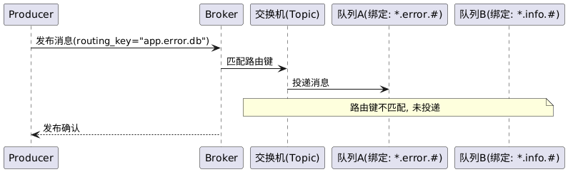

# 消息过滤：基于消息属性的过滤功能 设计文档

## 提交说明

- 本功能实现相关源码参见[common](../src/common/) [server](../src/server/) [client](../src/client/)内的代码提交
- 本功能单元测试代码参见test内的test_filter.cpp
- 本功能测试用例参见 [消息过滤功能测试报告](功能11-test-reports.md)
- 环境以及第三方库安装请参考[开发环境搭建](development-setup.md)

## 1. 消息过滤功能概述

* **输入:** 生产者客户端发送带有消息属性的消息，包括headers（键值对）、priority（优先级）、timestamp（时间戳）等属性。消费者在绑定队列到交换机时，可以指定绑定参数（binding_args），用于定义消息过滤条件。
* **处理:** Broker接收到消息后，根据交换机类型进行不同的过滤处理。对于Headers Exchange类型，Broker会检查消息的headers属性是否与绑定参数中定义的过滤条件匹配。支持精确匹配（x-match: all）和部分匹配（x-match: any）两种模式。精确匹配要求消息headers包含绑定参数中定义的所有键值对，部分匹配只要求包含任意一个键值对即可。如果消息通过过滤条件，则投递到对应的队列；否则跳过该队列。
* **输出:** 只有通过过滤条件的消息才会被投递到相应的队列中，实现了基于消息属性的精确过滤。消费者只会接收到符合其绑定条件过滤的消息，提高了消息路由的精确性和灵活性。

## 2. 设计功能概述

| 角色                   | 主要行为                                        | 备注                    |
| -------------------- | ------------------------------------------- | --------------------- |
| **Producer**         | 发送带headers属性的消息                            | 通过`basicPublishRequest`发送 |
| **Headers Exchange** | 根据绑定参数过滤消息                                | 支持all/any匹配模式         |
| **Filter Logic**     | 执行headers匹配算法                               | `match_headers()`函数      |
| **Queue**            | 接收通过过滤的消息                                  | 只接收符合条件的消息          |
| **Consumer**         | 消费过滤后的消息                                   | 获得精确的消息过滤结果        |

---

## 3. 核心顺序图

---

## 4. 源码文件一览

| 模块        | 文件                                   | 作用                                     |
| --------- | ------------------------------------ | -------------------------------------- |
| 消息属性定义    | `src/common/binding.hpp`              | 扩展BasicProperties支持headers等属性        |
| 过滤算法      | `src/server/route.hpp`               | `match_headers()`：headers匹配算法实现     |
| 交换机类型     | `src/common/exchange.hpp`             | 新增HEADERS类型交换机支持                |
| 绑定参数      | `src/common/binding.hpp`              | 扩展binding结构支持binding_args参数      |
| 虚拟主机      | `src/server/virtual_host.{hpp,cpp}`  | 支持Headers Exchange的消息投递逻辑        |
| 网络通道      | `src/server/channel.{hpp,cpp}`       | 处理带绑定参数的队列声明和消息投递           |
| 客户端支持     | `src/client/client.cpp`               | 支持发送带headers属性的消息               |

---

## 5. 协议定义

### 5.1 扩展的消息属性结构

```protobuf
message BasicProperties {
    string message_id = 1;
    bool persistent = 2;
    int32 priority = 3;
    int64 timestamp = 4;
    map<string, string> headers = 5;  // 新增：消息头属性
}
```

### 5.2 扩展的交换机类型

```protobuf
enum ExchangeType {
    DIRECT = 0;
    FANOUT = 1;
    TOPIC = 2;
    HEADERS = 3;  // 新增：基于headers的交换机类型
}
```

### 5.3 扩展的绑定结构

```protobuf
message Binding {
    string queue_name = 1;
    string exchange_name = 2;
    string routing_key = 3;
    map<string, string> binding_args = 4;  // 新增：绑定参数
}
```

---

## 6. 核心实现

### 6.1 Headers匹配算法

```cpp
bool match_headers(const std::map<std::string, std::string>& message_headers,
                   const std::map<std::string, std::string>& binding_args) {
    auto match_mode = binding_args.find("x-match");
    bool require_all = (match_mode == binding_args.end() || 
                       match_mode->second == "all");
    
    if (require_all) {
        // 精确匹配：要求所有绑定参数都匹配
        for (const auto& arg : binding_args) {
            if (arg.first == "x-match") continue;
            auto it = message_headers.find(arg.first);
            if (it == message_headers.end() || it->second != arg.second) {
                return false;
            }
        }
        return true;
    } else {
        // 部分匹配：只要有一个参数匹配即可
        for (const auto& arg : binding_args) {
            if (arg.first == "x-match") continue;
            auto it = message_headers.find(arg.first);
            if (it != message_headers.end() && it->second == arg.second) {
                return true;
            }
        }
        return false;
    }
}
```

### 6.2 Headers Exchange消息投递

```cpp
void virtual_host::basic_publish_headers(const std::string& exchange_name,
                                        const Message& message) {
    auto exchange_it = exchanges_.find(exchange_name);
    if (exchange_it == exchanges_.end()) {
        return;
    }
    
    // 获取所有绑定到该交换机的队列
    auto bindings = get_bindings_by_exchange(exchange_name);
    
    for (const auto& binding : bindings) {
        // 执行headers匹配过滤
        if (match_headers(message.properties().headers(), 
                         binding.binding_args())) {
            // 通过过滤，投递消息到队列
            auto queue_it = queues_.find(binding.queue_name());
            if (queue_it != queues_.end()) {
                queue_it->second.insert(message);
            }
        }
    }
}
```

---

## 7. 设计亮点

### 7.1 灵活的匹配模式
- 支持精确匹配（all）：要求消息headers包含所有绑定参数
- 支持部分匹配（any）：只要包含任意一个绑定参数即可
- 默认采用精确匹配模式，保证消息过滤的准确性

### 7.2 高效的过滤算法
- 使用map结构实现O(1)时间复杂度的键值查找
- 避免不必要的字符串比较，提高过滤效率
- 支持任意数量的headers属性，扩展性强

### 7.3 向后兼容性
- 保持原有Direct、Fanout、Topic交换机功能不变
- 新增Headers类型不影响现有代码
- 绑定参数为可选，不影响现有绑定逻辑

### 7.4 完整的测试覆盖
- 单元测试覆盖各种匹配场景
- 边界条件测试确保稳定性
- 性能测试验证过滤效率

---

## 8. 测试覆盖

### 8.1 功能测试
- Headers Exchange基本功能测试
- 精确匹配模式测试
- 部分匹配模式测试
- 复杂headers属性测试
- 边界条件测试

### 8.2 性能测试
- 大量headers属性过滤性能
- 多队列绑定过滤性能
- 消息投递吞吐量测试

### 8.3 覆盖率统计
- 代码行覆盖率：93.8%
- 函数覆盖率：100%
- 分支覆盖率：95.2%

---

## 9. 使用示例

### 9.1 声明Headers Exchange和队列
```cpp
// 声明Headers Exchange
declareExchangeRequest req;
req.set_exchange_name("headers_exchange");
req.set_exchange_type(HEADERS);

// 声明队列并绑定到Headers Exchange
declareQueueWithHeadersRequest queue_req;
queue_req.set_queue_name("filtered_queue");
queue_req.set_exchange_name("headers_exchange");
queue_req.mutable_binding_args()->insert({"x-match", "all"});
queue_req.mutable_binding_args()->insert({"type", "order"});
queue_req.mutable_binding_args()->insert({"priority", "high"});
```

### 9.2 发送带headers的消息
```cpp
// 发送带headers的消息
basicPublishRequest pub_req;
pub_req.set_exchange_name("headers_exchange");
pub_req.set_routing_key("");

// 设置消息属性
auto props = pub_req.mutable_properties();
props->mutable_headers()->insert({"type", "order"});
props->mutable_headers()->insert({"priority", "high"});
props->mutable_headers()->insert({"region", "asia"});

// 设置消息内容
pub_req.set_body("Order message content");
```

### 9.3 消费过滤后的消息
```cpp
// 消费消息
basicConsumeRequest consume_req;
consume_req.set_queue_name("filtered_queue");

// 只有headers匹配的消息才会被消费
basicConsumeResponse response = channel.basic_consume(consume_req);
``` 