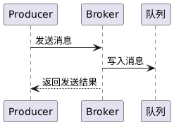

# 消息发送：点对点消息发送 功能设计文档

## 提交说明

<<<<<<< HEAD
<<<<<<< HEAD
- 本功能实现相关源码参见[common](../src/common/) [server](../src/server/) [client](../src/client/)内的代码提交
=======
- 本功能实现相关源码参见[common](../src/common/) [server](../src/server/)内的代码提交
>>>>>>> ae5edbe (完成功能1：点对点消息发送源码，测试代码，测试进行，功能描述文档，测试用例文档，测试报告文档)
=======
- 本功能实现相关源码参见[common](../src/common/) [server](../src/server/) [client](../src/client/)内的代码提交
>>>>>>> 3e459da (删除muduo库，添加开发环境搭建文档，添加client.cpp，添加makefile，修改功能1设计文档和测试报告)
- 本功能的单元测试代码参见test内的test_ptp.cpp
- 本功能单元测试的可执行程序位于一级目录的mq_test，运行即可进行单元测试
- 本功能的测试用例参见 [测试用例](test-cases.md)
- 本功能的测试报告参见 [功能1-test-reports](功能1-test-reports.md)
<<<<<<< HEAD
<<<<<<< HEAD
- 环境以及第三方库安装请参考[开发环境搭建](development-setup.md)
=======
>>>>>>> ae5edbe (完成功能1：点对点消息发送源码，测试代码，测试进行，功能描述文档，测试用例文档，测试报告文档)
=======
- 环境以及第三方库安装请参考[开发环境搭建](development-setup.md)
>>>>>>> 3e459da (删除muduo库，添加开发环境搭建文档，添加client.cpp，添加makefile，修改功能1设计文档和测试报告)

## 1.消息发送

* **输入:** 生产者客户端提出发送消息请求，指定目标交换机名称（或默认交换机）、路由键（如果交换机类型需要）以及消息内容。消息可以包含额外属性，如消息ID（若未提供则由系统生成）、是否持久化投递等。
* **处理:** Broker 接收到发送请求后，首先验证目标交换机是否存在；若不存在，则返回错误响应给生产者（发送失败）。如果交换机有效，Broker 将根据该交换机的类型和提供的路由键，确定目标队列（或多个队列）。对于 Direct 类型交换机，将寻找绑定键与路由键精确匹配的队列；Fanout 类型则选取所有绑定此交换机的队列；Topic 类型则计算哪些绑定模式能够匹配当前路由键的队列集合。然后，Broker 会将消息投入每一个目标队列中：在将消息写入队列时，如该队列配置为持久化且消息要求持久化，Broker 将在将消息加入内存队列的同时将其写入磁盘文件保存。消息进入队列后，如果该队列有消费者订阅，Broker 将立即触发消息投递流程（参见**3.2 消息接收**）。
* **输出:** 如果消息成功路由到至少一个队列，Broker 将发送确认响应给生产者客户端，告知消息发送成功。对于不需要确认的发送（如自动模式），生产者也可选择不等待确认直接进行下一次发送。若发送过程中出现问题（如目标交换机不存在，或路由键找不到任何匹配队列且系统配置为必须投递），Broker 将返回发送失败的错误信息。发送操作完成后，消息应已在目标队列中等待被消费或已投递给消费者，生产者端则结束此次发送请求。

## 2.顺序图
此顺序图展示了生产者客户端将消息发送到Broker并存入目标队列的过程。参与者包括生产者（Producer）、Broker服务器（Broker）和目标队列。生产者调用发送操作，Broker接收消息进行路由和存储，最后返回发送结果给生产者。

步骤解析：Producer通过网络向Broker发送消息内容和路由信息，Broker找到对应Queue并将消息写入内存队列（若队列持久化则同时写磁盘）。完成后Broker向Producer返回一个确认（以虚线表示应答）。该流程体现了消息从发送端到达Broker再进入存储队列的简单路径。
<<<<<<< HEAD
<<<<<<< HEAD
=======
>>>>>>> 3e459da (删除muduo库，添加开发环境搭建文档，添加client.cpp，添加makefile，修改功能1设计文档和测试报告)

## 3. 设计功能概述

| 角色                   | 主要行为                                        | 备注                    |
| -------------------- | ------------------------------------------- | --------------------- |
| **Producer**         | 调 `basicPublishRequest` 发送消息                | 由 `client.cpp` 触发     |
| **Broker**           | 解析请求 → 调 `channel::basic_publish` 路由 → 写入队列 | 见下文代码映射               |
| **Queue**            | 先进先出缓存消息                                    | `queue_message` 纯内存实现 |
| **Consumer/Channel** | 轮询取队首 → 回调用户 → 自动 Ack                       | `channel::consume()`  |

---

## 4. 核心顺序图 × 代码映射

| 顺序图步骤                               | 对应源码 & 关键逻辑                                                       | 说明                         |
| ----------------------------------- | ----------------------------------------------------------------- | -------------------------- |
| ① Producer 发送 `basicPublishRequest` | `client.cpp` ⟶ `g_codec->send(g_conn, req);`                               | 构建并序列化 PB 请求               |
| ② Broker `TcpServer` 收到消息           | `broker_server.cpp` → `on_basicPublish()`                         | Dispatcher 解包转入业务回调        |
| ③ Channel 做路由匹配                     | `channel::basic_publish()` 中 `router::match_route()` 调用           | 支持 direct / fanout / topic |
| ④ Virtual-host 将消息写入队列              | `virtual_host::basic_publish_queue()` / `queue_message::insert()` | 生成 PB Message 放入 deque     |
| ⑤ （可选）线程池异步派发                       | `thread_pool::push()`                                             | 解除网络线程阻塞                   |
| ⑥ Consumer 回调 → Broker 回复           | `channel::consume_cb()` 组装 `basicConsumeResponse`                 | 点对点场景下可由 Pull 或 Push 获取    |

---

## 5. 源码文件一览

| 模块        | 文件                                   | 作用                                     |
| --------- | ------------------------------------ | -------------------------------------- |
| 路由策略      | `src/server/route.hpp`               | `match_route()`：direct/topic/fanout 判定 |
| 虚拟主机      | `src/server/virtual_host.{hpp,cpp}`  | 队列/交换机/绑定注册 & 简单 publish / consume     |
| 消息容器      | `src/server/queue_message.hpp`       | 内存 deque + id 删除                       |
| 网络通道      | `src/server/channel.{hpp,cpp}`       | 将 PB 请求落到 virtual\_host，并做异步投递         |
| 线程池       | `src/common/thread_pool.{hpp,cpp}`   | 异步派发消费任务，保证高并发                         |
| Broker 启动 | `src/server/broker_server.{hpp,cpp}` | Muduo 监听器 + Dispatcher 注册              |

<<<<<<< HEAD
=======
>>>>>>> ae5edbe (完成功能1：点对点消息发送源码，测试代码，测试进行，功能描述文档，测试用例文档，测试报告文档)
=======
>>>>>>> 3e459da (删除muduo库，添加开发环境搭建文档，添加client.cpp，添加makefile，修改功能1设计文档和测试报告)
