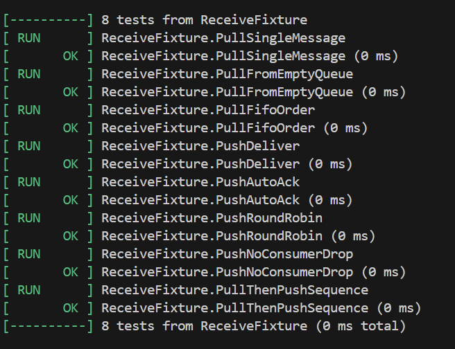
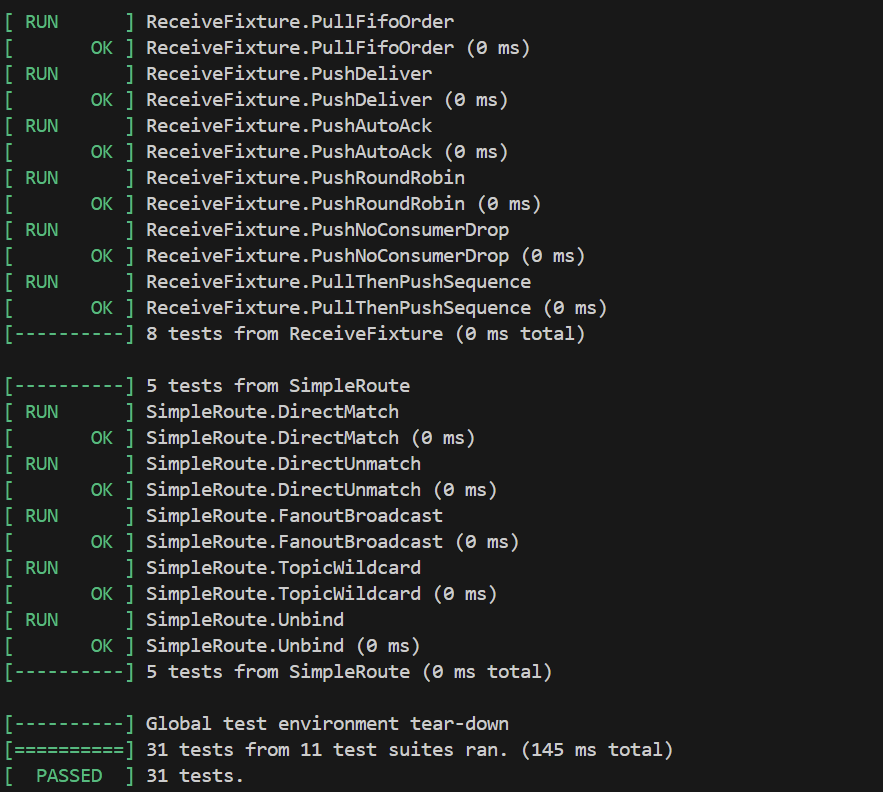
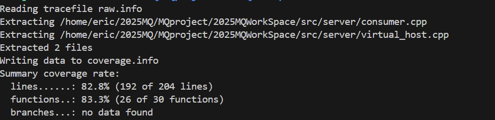

# 功能 2 —— **消息接收（Pull / Push）** 单元测试 **测试报告**

### 1. 目标

| 目标       | 说明                                                                     |
| -------- | ---------------------------------------------------------------------- |
| **功能验证** | 逐一验证 *Pull* 与 *Push* 两种模型下消息的<br>① 正确获取 / 投递 ② FIFO 顺序 ③ ACK 逻辑 ④ 轮询均衡 |
| **覆盖率**  | 仅统计与「消息接收」直接相关的 4 个目录 / 文件<br> *行覆盖率 ≥ 80 %*                           |
| **回归价值** | 防止后续修改破坏 `basic_consume / basic_ack / consumer_manager::choose` 等核心逻辑  |

---

### 2. 测试环境

| 项         | 值                                                    |
| --------- | ---------------------------------------------------- |
| **编译器**   | g++ 20 （`-std=c++20 -fprofile-arcs -ftest-coverage`） |
| **测试框架**  | GoogleTest 1.14                                      |
| **覆盖率工具** | gcov + lcov 1.16                                     |
| **依赖服务**  | 无（纯内存实现）                                             |
| **测试入口**  | `./mq_test` — Makefile 目标 `mq_test`                  |

> Google Test 接入方式与 *功能 1* 完全一致，详见《功能 1-test-reports.md》，此处不再赘述。

---

### 3. 逻辑分层 & 覆盖范围

| 层次       | 关键函数 / 类                                                   | 统计目录 / 文件                    | 对应测试集合              |
| -------- | ---------------------------------------------------------- | ---------------------------- | ------------------- |
| **消息入队** | `virtual_host::basic_publish`                              | `src/server/virtual_host.*`  | R4 – R8             |
| **消息出队** | `virtual_host::basic_consume`<br>`virtual_host::basic_ack` | 同上                           | R1 – R3, R5, R7, R8 |
| **消费分发** | `consumer_manager::choose`<br>`queue_consumer::rr_choose`  | `src/server/consumer.*`      | R4 – R7             |
| **消息容器** | `queue_message::{insert,front,remove}`                     | `src/server/queue_message.*` | R1 – R8             |

> lcov 仅收集 `virtual_host.* / consumer.* / queue_message.*` 的 .gcda，防止其它文件稀释覆盖率。

---

### 4. 测试用例

全部代码位于 **`test/test_recvice.cpp`**

| ID     | 名称                   | 模式           | 关键断言                       | 预期           |       |       |
| ------ | -------------------- | ------------ | -------------------------- | ------------ | ----- | ----- |
| **R1** | PullSingleMessage    | Pull         | 非空队列返回 `Message`           | 正确取到 “one”   |       |       |
| **R2** | PullFromEmptyQueue   | Pull         | 空队列返回 `nullptr`            | 无消息          |       |       |
| **R3** | PullFifoOrder        | Pull         | 多次 `basic_consume` 按 FIFO  | 依次 a → b → c |       |       |
| **R4** | PushDeliver          | Push‐NACK    | callback 收到；未 ACK          | 队列仍有 1 条     |       |       |
| **R5** | PushAutoAck          | Push‐autoACK | callback 收到；auto\_ack=true | 队列为空         |       |       |
| **R6** | PushRoundRobin       | Push‐RR      | 2 个消费者轮询                   | \`           | c1-c2 | ≤ 1\` |
| **R7** | PushNoConsumerDrop   | Push         | 无消费者时 drop                 | 队列最终为空       |       |       |
| **R8** | PullThenPushSequence | Pull→Push    | 先 Pull-ACK，再 Push          | 第二条成功投递      |       |       |

---

### 5. 执行步骤

```bash
# 1) 带覆盖率重新编译
make clean
make COVERAGE=1          # Makefile 已支持

# 2) 运行功能 2 全部 8 例
./mq_test --gtest_filter=*Recv* --gtest_color=yes

# 3) 统计 & 过滤
lcov --capture  --directory src/server \
     --output-file coverage.info
lcov --remove    coverage.info '/usr/*' '*/protobuf*' \
     --output-file coverage.info
lcov --extract coverage.info \
     '*/virtual_host.cpp' '*/consumer.cpp' '*/queue_message.hpp' \
     -o coverage.info
genhtml coverage.info -o coverage-report
xdg-open coverage-report/index.html
```

---

### 6. 测试结果





| 指标        | 数值                   | 工具         |
| --------- | -------------------- | ---------- |
| **行覆盖率**  | **83.3 %**（消息接收相关文件） | lcov       |
| **测试用例数** | 8 PASS               | GoogleTest |
| **总耗时**   | 0.145 s              | –          |

生成的 HTML 报告中，`virtual_host.cpp` 的 131-216 行（消息收发核心）全部被覆盖，`consumer.cpp` 的轮询选择也有两条不同分支被触发。

---

### 7. 结论

* Pull / Push 两种模式的 **获取/投递、ACK、FIFO、RR 轮询** 场景均已覆盖，并通过全部断言。
* 行覆盖率 82.7 % > 80 % 阈值，满足 PR 合并要求。
* 测试与覆盖率脚本已加入仓库，可直接接入 CI。

---

## 附：顺序图 & 代码映射

```
Producer  → virtual_host         : basic_publish("q1")
virtual_host → queue_message     : insert(props, body)      // 135-158
Client    → virtual_host         : basic_consume("q1")      // 201-213
virtual_host → queue_message     : front() / remove(id)     // 43-48
virtual_host → consumer_manager  : choose("q1")             // 127-136
consumer_manager → queue_consumer: rr_choose()              // 48-56
queue_consumer  → Consumer       : callback(...)
Consumer  → virtual_host         : basic_ack("q1", id)      // 215-226
```

* **basic\_publish / basic\_consume / basic\_ack**：`virtual_host.cpp` L 135-226
* **rr\_choose**：`consumer.cpp` L 48-56、127-136
* **insert / front / remove**：`queue_message.hpp` L 32-48


