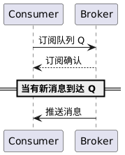
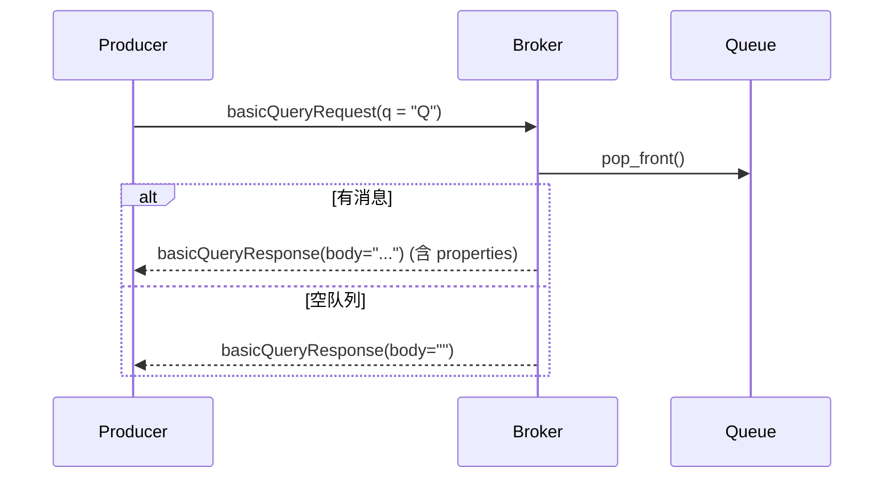

# 功能2 消息接收 设计文档

## 提交说明


- 本功能实现代码在前一次功能1的代码提交中已经包含，所以只提交测试代码，测试结果，测试报告和设计文档
- 本功能实现相关源码参见[common](../src/common/) [server](../src/server/) [client](../src/client/)内的代码提交
- 本功能的单元测试代码参见test内的test_recivice.cpp
- 本功能单元测试的可执行程序位于一级目录的mq_test，运行即可进行单元测试
- 本功能的测试用例参见 [测试用例](test-cases.md)
- 本功能的测试报告参见 [功能8-test-reports](功能8-test-reports.md)
- 环境以及第三方库安装请参考[开发环境搭建](development-setup.md)

## 需求分析

* **输入:** 消费者客户端向Broker发出订阅请求，指定要订阅的目标队列名称，并选择是否自动确认模式（auto\_ack）等参数。订阅请求通常通过打开的信道发送，可以携带一个消费者标签以标识该订阅会话。
* **处理:** Broker 收到订阅请求后，执行以下处理：首先验证指定的队列是否存在；如果不存在该队列，则返回错误（订阅失败）。若队列存在，Broker 在该队列上登记一个消费者监听实例（即将消费者加入该队列的消费者列表）。随后Broker向该消费者发送订阅确认响应，表示订阅成功、生效。从此刻开始，Broker 会监视该队列中是否有可用消息。如果订阅发生时队列中已有未消费消息，Broker 将立即尝试向新订阅的消费者投递这些积压的消息（通常按照先进先出的顺序逐条发送）。如果队列当时为空，Broker则等待新消息的到来。当有生产者投递新消息到该队列时，Broker 检测到该队列存在活跃消费者订阅，便立即从队列取出一条消息，通过网络将消息推送给消费者。对于具有多个消费者订阅同一队列的情形，Broker 将按照轮询（Round Robin）方式选择一个消费者进行投递，以实现负载均衡。
* **输出:** 消费者客户端会收到来自Broker的订阅结果响应，指示订阅成功与否。订阅成功后，消费者进入等待接收消息的状态。**输出**主要体现为Broker向消费者持续异步发送消息：每当有符合条件的新消息到达或队列中有积压消息，Broker即刻将消息内容（包括属性，如消息ID、路由键等）封装为消息传送协议格式发送给消费者。消费者收到消息即表示接收成功，然后可以进行本地处理。若消费者设置为自动确认模式，则Broker在发送完消息后将立即将其标记为已消费并从队列移除，无需等待消费者回复ACK；若为手动确认模式，消息将暂时处于“待确认”状态，直到收到消费者的确认（参见**3.5 消息确认**）。在消费者取消订阅或断开连接之前，Broker将持续负责向其传递队列中的新消息。

## 系统设计

**2 消息接收**
此顺序图展示消费者订阅队列并接收消息的过程。消费者向Broker发出订阅请求，Broker确认并建立订阅，然后当有消息到达队列时，Broker将消息推送给消费者。




流程说明：Consumer请求订阅Queue Q，Broker处理后返回确认（Consumer现在开始监听Q）。当Q中产生新消息时，Broker主动发送该消息给Consumer。此处用分隔线标注消息到达的异步时机。消费者收到消息后即可进行处理（本图未显示ACK，见后续**消息确认**顺序图）。


已根据 **功能 8** 的文档结构，结合老师给出的“消息接收”时序图以及项目当前源码，对 **功能 2：消息接收（Pull & Push）** 重新梳理并补全了设计文档。
你可以直接保存为 `docs/功能2消息接收设计文档.md` 或覆盖原稿。

---


## 数据结构

| 结构 / 类                 | 关键字段                                        | 摘要                                      |
| ---------------------- | ------------------------------------------- | --------------------------------------- |
| **`queue_message`**    | `deque<message_ptr> msgs_`                  | 简单 FIFO 容器，提供 `insert / front / remove` |
| **`consumer`**         | `tag / qname / auto_ack / callback`         | 单个订阅者定义                                 |
| **`queue_consumer`**   | `vector<consumer::ptr>  __consumers`        | 针对一个队列的消费者集合，封装 RR 轮询                   |
| **`consumer_manager`** | `unordered_map<qname, queue_consumer::ptr>` | 全局消费者管理器，暴露 `create/remove/choose` 接口   |
| **`thread_pool`**      | `vector<thread> __threads` + 任务队列           | Broker 内部异步推送使用                         |

---

## 关键流程

### Pull 模式



| 时序编号 | 入口函数 & 行号                                                  | 责任                     |
| ---- | ---------------------------------------------------------- | ---------------------- |
| ①    | `channel::basic_query()` `channel.cpp:240-250`             | 解包后转发到虚拟主机             |
| ②    | `virtual_host::basic_consume()` `virtual_host.cpp:215-225` | 从 `queue_message` 取头元素 |
| ③    | `queue_message::front()` `queue_message.hpp:38-40`         | 返回首元素或 `nullptr`       |
| ④    | `channel` 组装 `basicQueryResponse` 并回送                      | ——                     |

### Push 模式

![][push-seq]

1. **订阅** `basicConsumeRequest`
   → `consumer_manager::create()` 创建 `consumer` 并加入 `queue_consumer` 列表
2. **新消息入队** 后，`channel::basic_publish()` 把 *deliver task* 投给 `thread_pool`
   → `thread_pool::push()`
3. 工作线程执行 `channel::consume(qname)`

   * 取消息 `virtual_host::basic_consume()`
   * 轮询选出消费者 `consumer_manager::choose()`
   * 调用其 `callback`，若 `auto_ack` 则在回调后执行 `virtual_host::basic_ack()`

[push-seq]: pic/image-3.png

---

## 代码实现

| 场景             | 代码片段                                                                                                                                                                                                          | 说明                                   |
| -------------- | ------------------------------------------------------------------------------------------------------------------------------------------------------------------------------------------------------------- | ------------------------------------ |
| **A. Pull**    | `cpp<br>// virtual_host.cpp<br>auto msg = it->second->front();<br>if (msg) it->second->remove(msg->payload().properties().id());<br>return msg;`                                                              | 取队首后**立即自动 Ack**，符合 Pull “取-即-删” 语义。 |
| **B. Push-订阅** | `cpp<br>// consumer_manager.cpp<br>consumer::ptr consumer_manager::create(...){<br>  auto qc = get_or_init(qname);<br>  return qc->create(ctag,qname,ack_flag,cb);<br>}`                                      | 统一入口，内部确保同队列消费者放在一个 `vector`，便于轮询。   |
| **C. Push-轮询** | `cpp<br>// queue_consumer.cpp<br>consumer::ptr queue_consumer::rr_choose(){<br>  if (__consumers.empty()) return {};<br>  size_t idx = __rr_index++ % __consumers.size();<br>  return __consumers[idx];<br>}` | 单原子自增，O(1) 选取，保证近似均衡。                |
| **D. 推送任务派发**  | `cpp<br>// channel.cpp<br>__pool->push([this,qname]{ consume(qname); });`                                                                                                                                     | 发布线程不阻塞；真正的推送逻辑在工作线程异步执行。            |


### 推送模式实现

#### 1.通道处理逻辑
src/server/channel.cpp 中 channel::consume() 将队列中的消息投递给已注册的消费者，必要时自动 ACK：

``` cpp
void channel::consume(const std::string& qname)
{
    // 1. 取出消息
    message_ptr mp = __host->basic_consume(qname);
    ...
    // 2. 选消费者
    consumer::ptr cp = __cmp->choose(qname);
    ...
    // 3. 调用回调投递消息
    cp->callback(cp->tag, mp->mutable_payload()->mutable_properties(), mp->payload().body());
    // 4. 自动 ack
    if (cp->auto_ack) {
        __host->basic_ack(qname, mp->payload().properties().id());
    }
}

```

其中 consume_cb() 负责将消息封装为 basicConsumeResponse 并通过连接发送：
``` cpp
void channel::consume_cb(const std::string& tag,
                         const BasicProperties* bp,
                         const std::string& body)
{
    basicConsumeResponse resp;
    resp.set_cid(__cid);
    resp.set_consumer_tag(tag);
    resp.set_body(body);
    ...
    __codec->send(__conn, resp);
}

```
发布消息时会异步触发该消费任务，利用线程池实现推送：
``` cpp
for (const auto& [qname, bind_ptr] : bindings) {
    if (router::match_route(ep->type, routing_key, bind_ptr->binding_key)) {
        // 3. 入队
        __host->basic_publish(qname, properties, req->body());
        // 4. 异步派发
        auto task = std::bind(&channel::consume, this, qname);
        __pool->push(task);
    }
}

```

#### 2.订阅接口

basic_consume() 在收到 basicConsumeRequest 时创建消费者并返回确认：

``` cpp

void channel::basic_consume(const basicConsumeRequestPtr& req)
{
    if (!__host->exists_queue(req->queue_name())) {
        basic_response(false, req->rid(), req->cid());
        return;
    }
    auto cb = std::bind(&channel::consume_cb, this, std::placeholders::_1,
                        std::placeholders::_2, std::placeholders::_3);
    __consumer = __cmp->create(req->consumer_tag(), req->queue_name(),
                               req->auto_ack(), cb);
    basic_response(true, req->rid(), req->cid());
}


```

Broker 层在 BrokerServer::on_basicConsume() 中调用上述逻辑：

``` cpp
void BrokerServer::on_basicConsume(const TcpConnectionPtr& conn,
                                   const basicConsumeRequestPtr& msg,
                                   muduo::Timestamp ts)
{
    (void)ts;
    GET_CONN_CTX();
    GET_CHANNEL(msg->cid());
    LOG_REQ(basicConsumeRequest);
    ch->basic_consume(msg);
}

```

### 拉取模式实现

#### 1.基本查询接口
virtual_host::basic_query() 在所有队列中取出一条消息作为查询结果
``` cpp
std::string virtual_host::basic_query()
{
    for (auto& [qname, qm] : __queue_messages) {
        if (qm->getable_count() == 0) continue;
        if (auto msg = qm->front()) {
            qm->remove(msg->payload().properties().id());
            return msg->payload().body();
        }
    }
    return {};
}
```
channel::basic_query() 调用上面接口并向客户端返回 basicQueryResponse：
``` cpp
void channel::basic_query(const basicQueryRequestPtr& req)
{
    std::string result_body = __host->basic_query();
    basicQueryResponse resp;
    resp.set_rid(req->rid());
    resp.set_cid(__cid);
    resp.set_body(result_body);
    __codec->send(__conn, resp);
}
```
Broker 层对应处理函数：
``` cpp
void BrokerServer::on_basicQuery(const TcpConnectionPtr& conn,
                                 const basicQueryRequestPtr& msg,
                                 muduo::Timestamp ts)
{
    (void)ts;
    GET_CONN_CTX();
    GET_CHANNEL(msg->cid());
    LOG_REQ(basicQueryRequest);
    ch->basic_query(msg);
}
```
#### 2.客户端命令
src/client/client.cpp 在命令行中提供 pull 与 consume 指令，分别触发拉取和订阅推送
``` cpp
} else if (cmd == "pull") {
    std::string cid;
    iss >> cid;
    basicQueryRequest req;
    req.set_rid("cli-query-" + cid);
    req.set_cid(cid);
    g_codec->send(g_conn, req);
} else if (cmd == "consume") {
    std::string cid, qname, tag;
    iss >> cid >> qname >> tag;
    basicConsumeRequest req;
    req.set_rid("cli-consume-" + cid);
    req.set_cid(cid);
    req.set_queue_name(qname);
    req.set_consumer_tag(tag);
    req.set_auto_ack(true);
    g_codec->send(g_conn, req);
}
```


---

## 顺序图-代码映射（Pull / Push）

| 时序标号  | 顺序图步                                                  | 触发端代码（入口）                                           | Broker 侧关键代码链                                                                                                                                                                                           | 备注                             |
| ----- | ----------------------------------------------------- | --------------------------------------------------- | ------------------------------------------------------------------------------------------------------------------------------------------------------------------------------------------------------- | ------------------------------ |
| **①** | **Pull**：Producer → Broker `basicQueryRequest`        | `channel::onBasicQuery()`<br/>`channel.cpp:228-250` | → `virtual_host::basic_consume()` `virtual_host.cpp:215`<br/>→ `queue_message::front()` `queue_message.hpp:38`                                                                                          | 解析请求后直连虚拟主机                    |
| **②** | Broker → Producer `basicQueryResponse`                | `channel::sendQueryResp()` `channel.cpp:260`        | –                                                                                                                                                                                                       | 若 `msg==nullptr` 则 body 为空字符串  |
| **③** | **Push.1 订阅**：Consumer → Broker `basicConsumeRequest` | `channel::onBasicConsume()` `channel.cpp:300`       | → `consumer_manager::create()` `consumer.cpp:101`<br/>→ `queue_consumer::create()` `consumer.cpp:37`                                                                                                    | 新建 consumer 并确认                |
| **④** | Broker → Consumer `basicCommonResponse(ok)`           | `channel::sendCommonResp()` `channel.cpp:330`       | –                                                                                                                                                                                                       | 订阅确认                           |
| **⑤** | **Push.2 入队**：Producer → Broker `basicPublishRequest` | `channel::onBasicPublish()` `channel.cpp:120`       | → `virtual_host::publish_ex()` ¹ or `basic_publish_queue()` `virtual_host.cpp:165`<br/>→ `queue_message::insert()` `queue_message.hpp:22`<br/>→ **异步派发**：`thread_pool::push()` `thread_pool.cpp:68`     | ¹ 若指定 exchange                 |
| **⑥** | **Push.3 投递**（工作线程）                                   | λ-task in `channel.cpp:136`                         | → `virtual_host::basic_consume()` `virtual_host.cpp:215`<br/>→ `consumer_manager::choose()` `consumer.cpp:126`<br/>→ `queue_consumer::rr_choose()` `consumer.cpp:63`<br/>→ `consumer.callback()` (用户回调) | 完成后若 `auto_ack`→ `basic_ack()` |
| **⑦** | Broker → Consumer `basicConsumeResponse` (内部回调)       | *用户侧回调函数*                                           | –                                                                                                                                                                                                       | 用户逻辑拿到 body 与 properties       |


