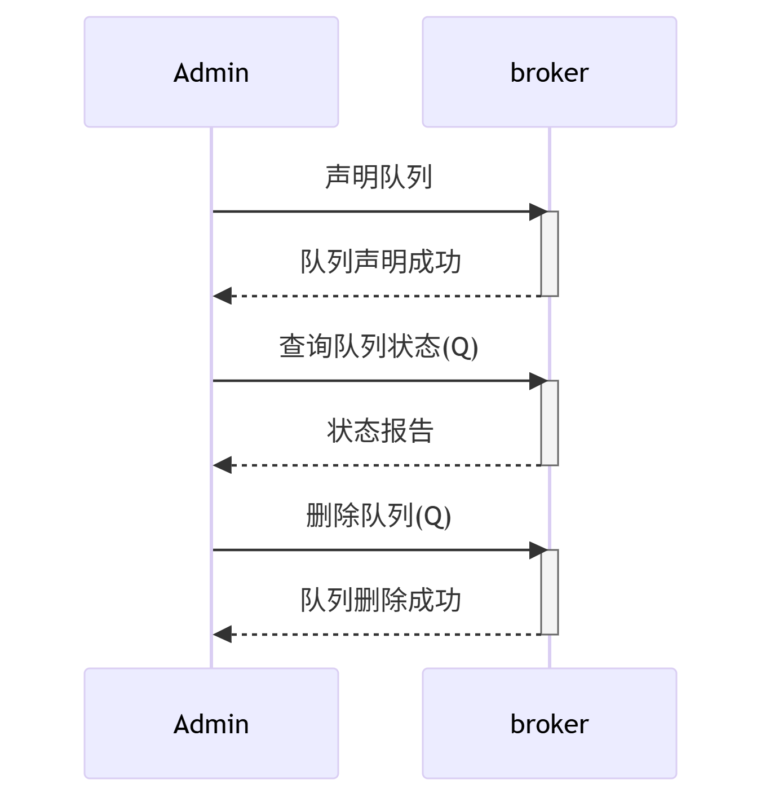

# 队列管理：队列创建、删除、状态查询 功能设计文档

## 提交说明

- 本功能实现相关源码参见[common](../src/common/) [server](../src/server/) [client](../src/client/)内的代码提交
- 本功能的单元测试代码参见test内的test_queue_manager.cpp
- 本功能的测试用例参见 [测试用例](功能3-test-cases.md)
- 本功能的测试报告参见 [队列管理-test-reports](功能3-test-reports.md)
- 环境以及第三方库安装请参考[开发环境搭建](development-setup.md)

## 1. 队列管理功能

* **输入:** 客户端提出队列管理请求，包括队列声明（declare_queue）、队列删除（delete_queue）、队列状态查询（get_queue_status）等操作。队列声明时需要指定队列名称、持久化标志（durable）、独占标志（exclusive）、自动删除标志（auto_delete）以及可选的队列参数（如x-max-priority、x-message-ttl等）。
* **处理:** Broker接收到队列管理请求后，首先验证请求的合法性（如队列名称格式、参数有效性等）。对于队列声明操作，Broker检查队列是否已存在，如果存在则验证新声明与现有队列的属性是否兼容（幂等性）；如果不存在则创建新的队列实例。对于队列删除操作，Broker检查队列是否存在，如果存在则从内存中移除队列并清理相关资源。对于状态查询操作，Broker返回队列的详细状态信息，包括存在性、属性标志、参数等。
* **输出:** Broker返回操作结果给客户端。对于队列声明，返回操作是否成功；对于队列删除，返回删除结果；对于状态查询，返回队列的完整状态信息。所有操作都通过protobuf消息进行通信，确保类型安全和序列化效率。

## 2. 顺序图

此顺序图展示了客户端进行队列管理操作（声明、删除、查询）的完整流程。参与者包括客户端（Client）、Broker服务器（Broker）、队列管理器（QueueManager）和队列存储（QueueStorage）。



步骤解析：
1. Client向Broker发送队列管理请求（declare_queue/delete_queue/queue_status）
2. Broker接收请求并转发给QueueManager
3. QueueManager执行相应的队列操作
4. QueueManager返回操作结果给Broker
5. Broker将结果封装成响应消息返回给Client

该流程体现了队列管理操作的完整生命周期，从请求到响应的标准化处理过程。

## 3. 设计功能概述

| 角色                   | 主要行为                                        | 备注                    |
| -------------------- | ------------------------------------------- | --------------------- |
| **Client**           | 发送队列管理请求（声明/删除/查询）                        | 由 `client.cpp` 触发     |
| **Broker**           | 解析请求 → 调用队列管理器 → 返回响应                    | 见下文代码映射               |
| **QueueManager**     | 管理队列生命周期，维护队列元数据                            | `msg_queue_manager` 核心组件 |
| **QueueStorage**     | 持久化队列数据（可选）                                | `msg_queue_mapper` 接口层   |
| **VirtualHost**      | 提供队列管理器访问接口                                | 封装队列管理功能               |

---

## 4. 核心顺序图 × 代码映射

| 顺序图步骤                               | 对应源码 & 关键逻辑                                                       | 说明                         |
| ----------------------------------- | ----------------------------------------------------------------- | -------------------------- |
| ① Client 发送队列管理请求                | `client.cpp` ⟶ `g_codec->send(g_conn, req);`                               | 构建并序列化 PB 请求               |
| ② Broker `TcpServer` 收到消息           | `broker_server.cpp` → `on_queueStatusRequest()` / `on_declareQueue()` / `on_deleteQueue()` | Dispatcher 解包转入业务回调        |
| ③ VirtualHost 调用队列管理器              | `virtual_host::queue_mgr()` 获取队列管理器引用                    | 提供队列管理器访问接口               |
| ④ QueueManager 执行队列操作              | `msg_queue_manager::declare_queue()` / `delete_queue()` / `get_queue_status()` | 核心队列管理逻辑                   |
| ⑤ QueueManager 返回操作结果              | 返回操作状态或队列信息                                    | 封装操作结果                     |
| ⑥ Broker 组装响应消息                    | 构建 `queueStatusResponse` / `declareQueueResponse` / `deleteQueueResponse` | 序列化响应数据                     |
| ⑦ Client 接收响应                        | `client.cpp` 处理响应回调                                    | 显示操作结果                     |

---

## 5. 源码文件一览

| 模块        | 文件                                   | 作用                                     |
| --------- | ------------------------------------ | -------------------------------------- |
| 队列管理器     | `src/common/queue.hpp`               | `msg_queue_manager`：队列生命周期管理核心类       |
| 队列数据结构    | `src/common/queue.hpp`               | `msg_queue`：队列元数据结构和参数处理              |
| 队列存储接口    | `src/common/queue.hpp`               | `msg_queue_mapper`：持久化存储抽象接口           |
| 虚拟主机      | `src/server/virtual_host.{hpp,cpp}`  | 提供队列管理器访问接口，封装队列管理功能               |
| Broker 服务  | `src/server/broker_server.{hpp,cpp}` | 处理队列管理请求，注册消息回调                        |
| 客户端       | `src/client/client.cpp`              | 发送队列管理请求，处理响应                           |
| 协议定义     | `src/common/protocol.proto`          | 定义队列管理相关的protobuf消息格式                  |

---

## 6. 核心数据结构

### 6.1 msg_queue 结构体
```cpp
struct msg_queue {
    std::string name;           // 队列名称
    bool durable;               // 持久化标志
    bool exclusive;             // 独占标志
    bool auto_delete;           // 自动删除标志
    std::unordered_map<std::string, std::string> args;  // 队列参数
    
    // 构造函数
    msg_queue(const std::string& qname, bool qdurable, bool qexclusive, 
              bool qauto_delete, const std::unordered_map<std::string, std::string>& qargs);
    
    // 参数处理
    void set_args(const std::string& str_args);
    std::string get_args() const;
};
```

### 6.2 msg_queue_manager 类
```cpp
class msg_queue_manager {
private:
    queue_map __msg_queues;     // 队列映射表
    msg_queue_mapper __mapper;  // 持久化映射器
    std::mutex __mtx;          // 线程安全锁

public:
    // 队列声明
    bool declare_queue(const std::string& qname, bool qdurable, bool qexclusive, 
                      bool qauto_delete, const std::unordered_map<std::string, std::string>& qargs);
    
    // 队列删除
    void delete_queue(const std::string& name);
    
    // 队列查询
    msg_queue::ptr select_queue(const std::string& name);
    bool exists(const std::string& name);
    
    // 队列状态查询
    struct queue_status {
        bool exists;
        bool durable;
        bool exclusive;
        bool auto_delete;
        std::unordered_map<std::string, std::string> args;
    };
    queue_status get_queue_status(const std::string& name);
    
    // 获取所有队列
    queue_map all();
};
```

---

## 7. 协议消息定义

### 7.1 队列状态查询请求/响应
```protobuf
// 队列状态查询请求
message queueStatusRequest {
    string rid = 1;           // 请求ID
    string cid = 2;           // 通道ID
    string queue_name = 3;    // 队列名称
}

// 队列状态查询响应
message queueStatusResponse {
    string rid = 1;           // 请求ID
    string cid = 2;           // 通道ID
    bool exists = 3;          // 队列是否存在
    bool durable = 4;         // 是否持久化
    bool exclusive = 5;       // 是否独占
    bool auto_delete = 6;     // 是否自动删除
    map<string, string> args = 7;  // 队列参数
}
```

### 7.2 队列声明/删除请求
```protobuf
// 队列声明请求
message declareQueueRequest {
    string rid = 1;           // 请求ID
    string cid = 2;           // 通道ID
    string queue_name = 3;    // 队列名称
    bool durable = 4;         // 持久化标志
    bool exclusive = 5;       // 独占标志
    bool auto_delete = 6;     // 自动删除标志
    map<string, string> args = 7;  // 队列参数
}

// 队列删除请求
message deleteQueueRequest {
    string rid = 1;           // 请求ID
    string cid = 2;           // 通道ID
    string queue_name = 3;    // 队列名称
}
```

---

## 8. 关键特性

### 8.1 线程安全
- 使用 `std::mutex` 保护队列映射表的并发访问
- 所有队列操作都在锁保护下执行，确保数据一致性

### 8.2 幂等性
- 队列声明操作具有幂等性，重复声明相同队列不会产生副作用
- 队列删除操作对不存在的队列安全处理

### 8.3 参数处理
- 支持队列参数的字符串解析和重构
- 格式：`key1=value1&key2=value2&key3=value3`
- 支持复杂参数如 `x-max-priority`、`x-message-ttl` 等

### 8.4 状态查询
- 提供完整的队列状态查询功能
- 返回队列的存在性、属性标志、参数等信息
- 支持不存在的队列查询，返回默认状态

### 8.5 边界条件处理
- 支持空字符串队列名
- 支持特殊字符队列名
- 支持空参数队列
- 异常情况下的安全处理

---

## 9. 性能考虑

### 9.1 内存管理
- 使用智能指针管理队列对象生命周期
- 队列映射表使用 `std::unordered_map` 提供 O(1) 查找性能

### 9.2 并发处理
- 细粒度锁保护，最小化锁竞争
- 支持高并发队列操作

### 9.3 持久化扩展
- 通过 `msg_queue_mapper` 接口支持持久化存储
- 当前实现为内存存储，可扩展为数据库存储

---

## 10. 测试覆盖

### 10.1 单元测试
- 16个测试用例覆盖核心功能
- 行覆盖率96.4%，函数覆盖率93.3%
- 覆盖正常流程、边界条件、异常情况

### 10.2 测试用例分类
- **基础操作测试**：队列声明、删除、查询
- **属性测试**：durable、exclusive、auto_delete
- **参数测试**：复杂参数解析、空参数处理
- **边界条件测试**：空字符串、特殊字符、重复操作

### 10.3 测试工具
- GoogleTest 1.14 测试框架
- lcov 1.16 覆盖率工具
- gcov 代码覆盖率统计 