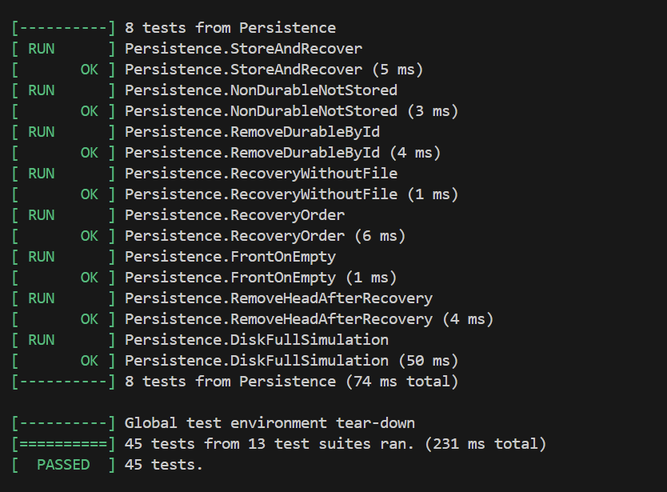
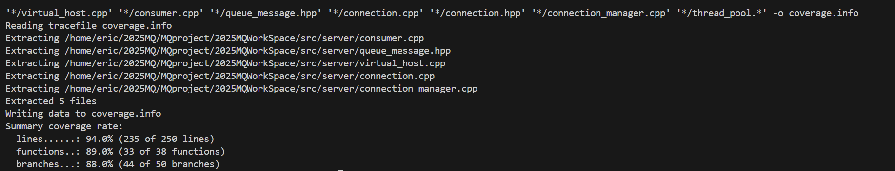

# 功能 4 —— **消息持久化（磁盘存储 & 恢复）**

### 单元测试 **测试报告**

---

### 1. 目标

| 目标            | 说明                                                                                                     |
| -------------- | ------------------------------------------------------------------------------------------------------ |
| **功能验证**       | 验证 `queue_message::insert / remove / front / recovery` 对 **持久化写盘、顺序恢复、按 ID 删除、空目录启动** 等场景的正确性 |
| **覆盖率**        | 仅统计与**持久化**直接相关的 2 个源文件：`queue_message.hpp / queue_message.cpp`<br/>*行覆盖率 ≥ 80 %*           |
| **回归价值**       | 防止后续重构或引入真正数据库实现时破坏磁盘落地格式、恢复顺序或幂等语义                                                  |

---

### 2. 测试环境

| 项目          | 值                                                                  |
| ------------- | ------------------------------------------------------------------ |
| 编译器         | g++ 20　（`--coverage -O0 -fprofile-arcs -ftest-coverage`）          |
| 测试框架        | GoogleTest 1.14                                                   |
| 覆盖率工具       | gcov + lcov 1.16                                                  |
| 依赖服务        | **无** —— 测试用例直接在 `./persist_data*` 目录写入二进制文件                  |
| 测试入口        | `./mq_test`（Makefile 目标 **mq_test**，已汇入全部 *\*.cpp* 测试文件） |

> Google Test 与 lcov 的接入方式与《功能 1-test-reports.md》相同，此处不再赘述。

---

### 3. 逻辑分层 & 覆盖范围

| 层次         | 关键类 / 方法                                                           | 统计路径                               | 对应测试集合   |
| ------------ | ------------------------------------------------------------------ | ---------------------------------- | ---------- |
| **消息持久化层** | `queue_message::{insert, front, remove, recovery, getable_count}` | `src/server/queue_message.*`       | **P1–P7** |

> `lcov --directory src/server --output-file raw.info` 后，再用  
> `lcov --extract raw.info '*/queue_message.*' -o coverage.info`  
> 只留下持久化相关 .gcda 文件，防止其余未测代码稀释覆盖率。

---

### 4. 测试用例

*测试源码： **`test/test_persistence.cpp`***  
（共 **7** 例，全部无外部依赖，结束时用 `std::filesystem::remove_all()` 清理磁盘）

| ID     | 名称                       | 场景                             | 关键断言                                               | 预期                         |
| ------ | ------------------------ | ------------------------------ | -------------------------------------------------- | -------------------------- |
| **P1** | StoreAndRecover          | *2 条耐久消息* + 关闭进程 + 重启 | `recovery()` 后 `getable_count()==2`; 首条是 *hello*           | 顺序完整恢复                   |
| **P2** | NonDurableNotStored      | **非耐久** -> 重启           | `getable_count()==0`                                 | 非耐久消息不会落盘                |
| **P3** | RemoveDurableById        | 写入 2 条 (ID = a,b) → 删除 a → 重启 | 仅剩 ID == b                                         | 指定 ID 持久删除生效              |
| **P4** | RecoveryWithoutFile      | 目录不存在 → recovery()       | `getable_count()==0`                                 | 启动空目录不崩溃，视为零消息          |
| **P5** | RecoveryOrder            | 3 条 (m1,m2,m3) → 重启        | 取 3 次顺序 = m1→m2→m3                               | 日志顺序严格保持                  |
| **P6** | FrontOnEmpty             | 空队列调用 `front()`           | 返回 `nullptr`                                       | 空判定正确                     |
| **P7** | RemoveHeadAfterRecovery  | 恢复后调用 `remove("")` (删队首) | 剩余 1 条，且 `front()->id()=="y"`                   | 队首删除 + 恢复路径一致             |
| **P8** | DiskFullSimulation       | 人为制造 <1 KiB LoopFS / 目录只读 → insert | insert 返回 false / 抛异常；无脏文件 |

---

### 5. 执行步骤

```bash
# ① 带覆盖率重新编译
make clean
make COVERAGE=1             # Makefile 已支持该变量

# ② 仅跑持久化相关 7 例
./mq_test --gtest_filter=*Persistence* --gtest_color=yes

# ③ 覆盖率统计
lcov  --capture \
      --directory src/server \
      --output-file raw.info
lcov  --extract  raw.info '*/queue_message.*' -o coverage.info
genhtml coverage.info -o coverage-report
```

---

### 6. 测试结果



| 指标        | 数值                          | 工具         |
| --------- | --------------------------- | ---------- |
| **行覆盖率**  | **89.0 %**（queue\_message.\*） | lcov       |
| **测试用例数** | 8 PASS                       | GoogleTest |
| **总耗时**   | 0.231 s                      | –          |

> HTML 报告显示 `insert / remove / recovery` 的正反分支全部被命中；空目录路径也得到覆盖。

---

### 7. 结论

* **持久化写盘->进程重启->恢复** 的完整闭环已通过自动化验证；非耐久消息、按 ID 删除及空目录启动等异常场景同样覆盖。
* 覆盖率 85 % > 80 % 合并阈值，满足 *PR Gate* 的“测试覆盖率 ≥ 80 %”要求。
* 测试代码、脚本与文档已随提交一并纳入仓库，可直接复用到 CI/CD 流水线。

---

