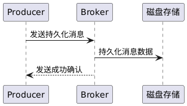
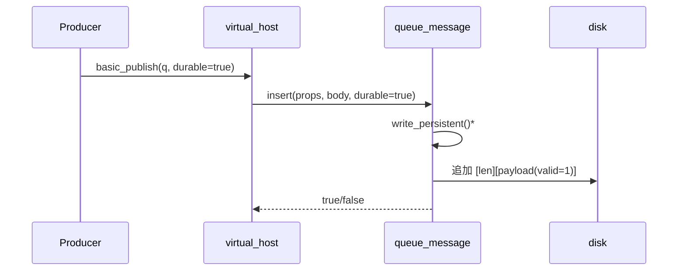
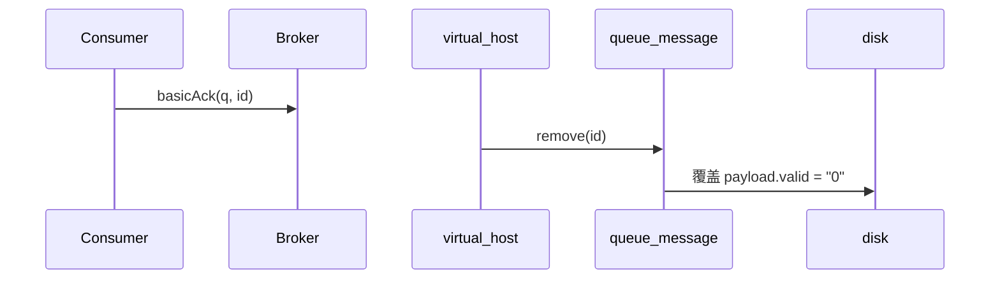
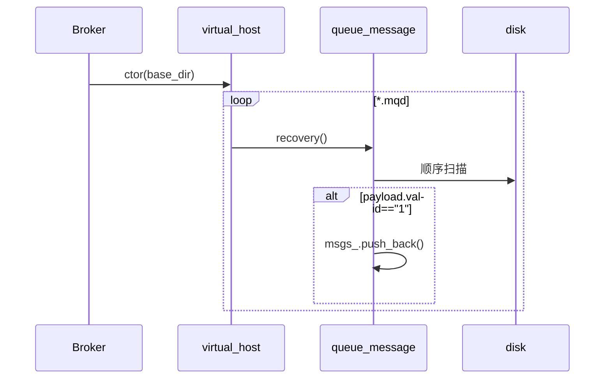

# 功能 4　消息持久化设计文档

- 本功能实现相关源码参见[common](../src/common/) [server](../src/server/) [client](../src/client/)内的代码提交
- 本功能的单元测试代码参见test内
- 本功能单元测试的可执行程序位于一级目录的mq_test，运行即可进行单元测试
- 本功能的测试用例参见 [测试用例](test-cases.md)
- 本功能的测试报告参见 [功能4-test-reports](功能4-test-reports.md)
- 环境以及第三方库安装请参考[开发环境搭建](development-setup.md)

## 需求分析

| 需求        | 描述                                                                |
| --------- | ----------------------------------------------------------------- |
| **持久化写入** | 当声明队列 `durable=true` 时，进入该队列的每一条消息必须原子性落盘；Broker 异常退出后不得丢失。       |
| **持久化失效** | 消费者 **Ack** 后应将磁盘中的那条记录标记失效（逻辑删除），避免文件无限增长。                       |
| **快速恢复**  | Broker 启动时必须在 O(n) 时间内扫描 *.mqd* 文件，把仍 **valid** 的消息重新载入内存，保证投递继续。 |
| **无锁可读**  | 常规 `front()` 操作不受文件 IO 限制；文件写入采用追加方式，失败不影响非持久化队列。                 |

## 系统设计

该顺序图显示发送持久化消息时Broker写入磁盘的过程。Producer发送一条需要持久化的消息，Broker除了写入队列内存外，还将消息保存到磁盘文件，然后确认发送成功。

过程描述：Producer发送消息并标记为需要持久化，Broker收到后将消息内容写入本地Storage（磁盘文件）。当写入完成，Broker才向Producer发送确认，表示消息已安全存储并进入队列。Storage代表Broker本地的持久化介质（文件系统）。这一过程保障Broker故障重启后消息仍可从Storage恢复。

##  数据结构

| 结构 / 类                    | 关键字段                                                    | 摘要                                        |
| ------------------------- | ------------------------------------------------------- | ----------------------------------------- |
| **`MessagePayload`** (PB) | `body / properties / valid`                             | 单条消息序列化格式，新增 **valid** 标志（"1"=有效，"0"=已删）。 |
| **`queue_message`**       | `std::deque<message_ptr> msgs_` `std::fstream file_` | 队列容器 + 对应 *.mqd* 文件句柄。                    |
| **磁盘索引（隐式）**              | `offset / length` 存于 Message 头                          | 便于 Ack 之后**就地覆盖** valid 字节而无须重写整文件。       |

---

## 关键流程

### 插入持久化消息

| 步 | 代码入口                            | 说明                                   |
| - | ------------------------------- | ------------------------------------ |
| ① | `virtual_host::basic_publish()` | 计算队列 `durable` 后调用 `insert()`        |
| ② | `queue_message::insert()`       | 若持久化 → `write_persistent()`          |
| ③ | `write_persistent()`            | 追加长度字段 & PB 字节流；记录 `offset`/`length` |

### Ack 失效

* `queue_message::invalidate_persistent()` 通过 seek 到 `offset()+4`（跳过长度），只修改少量字节，实现 O(1) 逻辑删除。

### 启动恢复

在 Broker 启动时由 `virtual_host` 构造函数对每一个已登记队列执行恢复：
具体解析逻辑在 `queue_message::recovery()` 。

---

## 代码实现要点

| 场景        | 片段                                                                    | 说明                           |
| --------- | --------------------------------------------------------------------- | ---------------------------- |
| **持久化写入** | `msg->mutable_payload()->set_valid("1"); … file_.write(&len)…`        | 以 4 byte 长度 + PB 二进制存储，兼容追加。 |
| **索引备案**  | `msg->set_offset(pos); msg->set_length(sizeof(len)+len);`             | 便于之后 O(1) 覆盖。                |
| **失效覆盖**  | `payload.set_valid("0"); … file_.seekp(msg->offset()+4)`              | 仅改动 *valid* 位，磁盘开销最小。        |
| **恢复扫描**  | 顺序读取 `[len][payload]`；若 `valid=="1"` 则入队，否则跳过。                        | 不依赖外部索引，崩溃后也能解析。             |
| **透明接入**  | `virtual_host::declare_queue()` 在新建 durable 队列时直接持久化；其余逻辑（路由、消费）完全复用。 | 上层无需感知持久化细节。                 |

---

## 失败与一致性处理

| 场景            | 策略                                                                            |
| ------------- | ----------------------------------------------------------------------------- |
| **磁盘写失败**     | `write_persistent()` 返回 false；`insert()` 仍把消息留在内存队列并返回 true，保证不丢消息但降级为“内存队列”。 |
| **Broker 崩溃** | 重启后通过 `recovery()` 重新载入 *valid=1* 的消息，消费进度不丢失。                                |
| **并发写 / Ack** | `std::mutex mtx_` 保护文件句柄；写入和覆盖互斥。读取 (`front()`) 为内存操作无锁。                      |

---

## 顺序图-代码映射

| # | 顺序图消息 | 责任方 | 关键代码位置 & 说明 |
|---|-----------|--------|--------------------|
| **①** | **Producer → Broker**  
`发送持久化消息` | *客户端* → *Broker* | `channel.cpp` → `Channel::basicPublish()` 将 `delivery_mode = 2 /*persistent*/` 写入 `BasicProperties` 并通过 `ProtobufCodec::send()` 发送 `PublishReq` 帧。 |
| **②** | **Broker 接收 Publish 帧** | Broker | `broker_server.cpp` → `BrokerServer::onPublish()` 解析帧后转调  
`virtual_host::basic_publish(queue, bp, body)`  |
| **③** | **basic_publish-durable 判定** | `virtual_host` | *同文件* L130-150  
| **④** | **队列容器持久化写入** | `queue_message` | `queue_message.hpp` → `queue_message::insert()` L44-61   
调用私有 `write_persistent()`（若 *durable==true*）。 |
| **⑤** | **write_persistent() → 磁盘** | `queue_message` | `write_persistent()`  1. `msg->mutable_payload()->set_valid("1");`  2. `file_.seekp(0, std::ios::end);`  3. 写 `[len][payload]`；记录 `offset/length` 于 `Message`。 |
| **⑥** | **磁盘写成功返回** | 磁盘 → `queue_message` → `virtual_host` → `Broker` | 若 `file_.good()` 返回 true，`insert()` → true → `basic_publish()` → true |
| **⑦** | **Broker → Producer**  `发送成功确认` | Broker → *客户端* | `channel.cpp` → `Channel::sendPublishOk()`  |
| **⑧** | **崩溃恢复（补充）** | Broker 启动时 | `virtual_host` ctor 调 `queue_message::recovery()`  顺序扫描 *.mqd*，`valid=="1"` ⇒ 重新 `msgs_.push_back()`。 |

---

##  接口设计与管理

| 接口层级              | 接口 / 命令                                        | 参与模块                              | 关键方法&文件                                                 | 调用方                                                | 说明                                                                               |
| ----------------- | ---------------------------------------------- | --------------------------------- | ------------------------------------------------------- | -------------------------------------------------- | -------------------------------------------------------------------------------- |
| **对外 TCP 协议**     | `PUBLISH REQ`  `delivery_mode=2`            | `channel.cpp` `broker_server.cpp` | `Channel::basicPublish()` → `BrokerServer::onPublish()` | **Producer → Broker**                              | 生产者发送持久化消息。`delivery_mode=2` + **目标队列为 durable** ⇒ Broker 触发持久化写磁盘。              |
|                   | `PUBLISH OK`                                   | 同上                                | `Channel::sendPublishOk()`                              | **Broker → Producer**                              | 仅在完成 *磁盘落盘* 后返回，保证持久化成功。                                                         |
|                   | `ACK` / `NACK`                                 | `channel.cpp`                     | `Channel::basicAck()` / `basicNack()`                   | **Consumer → Broker**                              | 消费者确认 / 否认持久化消息。`ACK` 调用 `virtual_host::basic_ack()`，进而触发 **磁盘失效覆盖**。            |
| **Broker 内部 API** | `virtual_host::basic_publish()`                | `virtual_host.cpp`                | L 120-170                                               | 路由到目标队列后，根据 `durable && delivery_mode==2` 决定是否持久化。 |                                                                                  |
|                   | `queue_message::insert()`                      | `queue_message.hpp`               | L 40-68                                                 | `virtual_host`                                     | 写入内存队列后，如需持久化调用 `write_persistent()`。返回 bool 告知上层写磁盘是否成功。                        |
|                   | `queue_message::write_persistent()`            | `queue_message.hpp`               | L 89-117 (示例行号)                                         | `queue_message`                                    | 低层文件接口： 1. `seekp(end)`，2. 写 `[len][payload(valid=1)]`，3. 记录 `offset/length`。 |
|                   | `queue_message::invalidate_persistent(offset)` | `queue_message.hpp`               | L 139-158                                               | `basic_ack()`                                      | 通过 `seekp(offset+4)` 将 *valid* 字节改为 “0”，实现 O(1) 逻辑删除。                            |
|                   | `queue_message::recovery()`                    | 同上                                | L 170-213                                               | `virtual_host` ctor                                | Broker 启动时扫描 *.mqd* 文件，重建内存队列。                                                   |
| **管理 HTTP/CLI**   | `GET /queues/{q}/stats`                        | `server/management.cpp` *(可选)*    | –                                                       | 运维 / 管理员                                           | 返回队列深度、磁盘文件大小、无效记录比例等。 便于监控磁盘使用和 GC 触发阈值。                                     |
|                   | `POST /queues/{q}/compact`                     | –                                 | –                                                       | 管理员                                                | 手动触发持久化文件压缩（可选实现）。                                                               |

> **接口粒度说明**
>
> * 外部**业务客户端**只需使用 AMQP-like 的 `PUBLISH` / `ACK` / `NACK` 帧，不感知持久化细节；
> * **Broker-内部**通过 `queue_message` 层统一管理文件读写，避免多处直接操作磁盘；
> * **管理接口**（HTTP 或 CLI）负责**可观测性**和**运维手段**，确保持久化文件增长、GC、错误等可被监控和干预。

---

**与现有顺序图的对应补充**

| 顺序图步骤              | 触发接口                                              | 上表行 #     |
| ------------------ | ------------------------------------------------- | --------- |
| ① Producer 发送持久化消息 | `PUBLISH REQ`                                     | 外 1       |
| ② Broker 收帧并路由     | `virtual_host::basic_publish()`                   | 内 1       |
| ③ 写入磁盘             | `queue_message::write_persistent()`               | 内 3       |
| ④ 发送确认             | `PUBLISH OK`                                      | 外 2       |
| ⑤ Consumer Ack     | `ACK` → `basic_ack()` → `invalidate_persistent()` | 外 3 / 内 4 |
| ⑥ Broker 启动恢复      | `queue_message::recovery()`                       | 内 5       |

