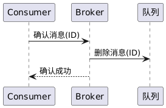

# 功能5-消息确认（ACK）设计文档

## 1. 功能描述

消息确认（ACK）机制用于保障消息队列系统中消息的可靠投递和消费。消费者在成功处理消息后，需向服务端发送ACK确认，服务端收到ACK后将消息从队列中移除。支持手动ACK和自动ACK两种模式，确保消息不会因网络或进程异常而丢失。

---

## 2. 顺序图

## 3. 主要代码映射

- 协议层：
  - `src/common/protocol.proto`：定义`basicAckRequest`、`basicAckResponse`等消息
- 服务端：
  - `src/common/virtual_host.cpp`：`virtual_host::basic_ack`、`basic_consume`、`basic_publish`
  - `src/common/queue_message.cpp`：`queue_message::remove`、`queue_message::find`
- 客户端：
  - 消费端收到消息后调用`basic_ack`接口
- 单元测试：
  - `test/test_ack.cpp`：覆盖ACK机制的各类场景

---

## 4. 核心数据结构

- `queue_message`：消息队列的消息存储与查找、移除
- `virtual_host`：队列管理、消息投递、ACK处理的核心类
- `basicAckRequest`/`basicAckResponse`：protobuf定义的ACK协议消息

---

## 5. 协议与接口

- **basicAckRequest**
  - 字段：`queue_name`、`msg_id`
  - 用途：客户端确认已消费消息
- **basicAckResponse**
  - 字段：`success`、`error_msg`
  - 用途：服务端反馈ACK处理结果
- **接口映射**
  - `virtual_host::basic_ack(queue_name, msg_id)`
  - `queue_message::remove(msg_id)`

---

## 6. 特性与边界

- 支持手动ACK和auto_ack两种模式
- ACK幂等性：同一消息多次ACK只生效一次
- 错误ACK（如msg_id不存在）不会影响队列状态
- 空队列ACK、错误队列名ACK均安全无副作用
- 多队列场景下ACK互不影响

---

## 7. 性能与测试覆盖

- 主要操作为哈希查找与删除，性能高效
- 单元测试覆盖率高，覆盖正常、异常、边界、幂等等场景
- 详见`test/test_ack-test-reports.md`与覆盖率报告

## 9. 附录

- 主要协议文件：`src/common/protocol.proto`
- 主要实现文件：`src/common/virtual_host.cpp`、`src/common/queue_message.cpp`
- 主要测试文件：`test/test_ack.cpp`
- 相关测试报告：`test/test_ack-test-reports.md` 