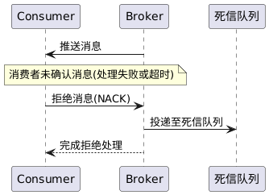

# 死信队列功能设计文档

## 提交说明

- 本功能实现相关源码参见[common](../src/common/) [server](../src/server/)内的代码提交
- 本功能的单元测试代码参见test内的test_dlq.cpp
- 本功能的测试报告参见 [死信队列功能测试报告](功能6-test-report.md)
- 环境以及第三方库安装请参考[开发环境搭建](development-setup.md)

## 1. 死信队列功能概述

* **输入:** 消费者客户端对消息进行拒绝（NACK）操作，指定队列名称、消息ID、是否重新入队（requeue）以及拒绝原因。队列可以配置死信队列参数，包括死信交换机名称、死信路由键和最大重试次数。
* **处理:** Broker 接收到 NACK 请求后，首先验证目标队列是否存在；若不存在，则返回错误响应。如果队列有效，Broker 将检查队列是否配置了死信队列。如果配置了死信队列且 requeue 为 false，Broker 将创建死信消息（包含原始消息内容、拒绝原因、时间戳等信息），并通过死信交换机路由到死信队列。如果队列没有配置死信队列或 requeue 为 true，则按照原有逻辑处理（重新入队或直接删除）。死信消息具有独立的属性，包括新的消息ID、死信标记等。
* **输出:** 如果死信消息成功投递到死信队列，Broker 将发送确认响应给消费者客户端。死信消息可以在死信队列中被单独处理，用于问题诊断、消息重试或人工干预。原始消息将从原队列中删除，避免重复处理。

## 2. 顺序图

此顺序图展示了消费者拒绝消息并投递到死信队列的过程。参与者包括消费者（Consumer）、Broker服务器（Broker）、原始队列（Original Queue）、死信交换机（Dead Letter Exchange）和死信队列（Dead Letter Queue）。

```
Consumer → Broker: basicNackRequest
Broker → Original Queue: 查找消息
Original Queue → Broker: 返回消息
Broker → Dead Letter Exchange: 创建死信消息
Dead Letter Exchange → Dead Letter Queue: 路由死信消息
Broker → Original Queue: 删除原始消息
Broker → Consumer: basicCommonResponse
```

步骤解析：Consumer通过网络向Broker发送NACK请求，Broker找到对应消息并创建死信消息，通过死信交换机路由到死信队列，删除原始消息，最后向Consumer返回确认。该流程体现了消息从拒绝到死信队列的完整路径。

## 3. 设计功能概述

| 角色                   | 主要行为                                        | 备注                    |
| -------------------- | ------------------------------------------- | --------------------- |
| **Consumer**         | 调 `basicNackRequest` 拒绝消息                | 指定 requeue 和拒绝原因     |
| **Broker**           | 解析请求 → 检查死信配置 → 创建死信消息 → 路由到死信队列 | 见下文代码映射               |
| **Original Queue**   | 提供原始消息内容                                    | `queue_message` 实现 |
| **Dead Letter Exchange** | 接收死信消息并路由到死信队列                       | 支持所有交换机类型 |
| **Dead Letter Queue** | 存储死信消息供后续处理                              | 独立的消息存储 |

---

## 4. 顺序图



---

## 5. 源码文件一览

| 模块        | 文件                                   | 作用                                     |
| --------- | ------------------------------------ | -------------------------------------- |
| 死信队列核心   | `src/server/virtual_host.{hpp,cpp}`  | `basic_nack()` / `declare_queue_with_dlq()` |
| 死信消息容器   | `src/server/queue_message.hpp`       | 死信消息的存储和管理                       |
| 网络通道      | `src/server/channel.{hpp,cpp}`       | 将 PB 请求落到 virtual_host，处理 NACK 请求         |
| 协议定义      | `src/common/protocol.proto`   | 定义死信队列相关的 protobuf 消息结构                         |
| Broker 启动 | `src/server/broker_server.{hpp,cpp}` | 注册死信队列相关的消息处理器              |

---

## 6. 新增协议结构

### 6.1 死信队列配置
```protobuf
message deadLetterConfig {
    string exchange_name = 1;  // 死信交换机名称
    string routing_key = 2;    // 死信路由键
    uint32 max_retries = 3;    // 最大重试次数
}
```

### 6.2 带死信队列配置的队列声明
```protobuf
message declareQueueWithDLQRequest {
    string rid = 1;
    string cid = 2;
    string queue_name = 3;
    bool exclusive = 4;
    bool durable = 5;
    bool auto_delete = 6;
    map<string, string> args = 7;
    deadLetterConfig dlq_config = 8;  // 死信队列配置
}
```

### 6.3 消息拒绝请求
```protobuf
message basicNackRequest {
    string rid = 1;
    string cid = 2;
    string queue_name = 3;
    string message_id = 4;
    bool requeue = 5;  // 是否重新入队（false表示投递到死信队列）
    string reason = 6; // 拒绝原因
}
```

### 6.4 死信消息结构
```protobuf
message deadLetterMessage {
    Message original_message = 1;
    string original_queue = 2;
    string reject_reason = 3;
    uint64 reject_timestamp = 4;
    uint32 retry_count = 5;
}
```

---

## 7. 核心功能实现

### 7.1 死信队列配置
- 支持在队列声明时配置死信队列参数
- 死信配置包括交换机名称、路由键和最大重试次数
- 配置信息存储在队列元数据中

### 7.2 消息拒绝处理
- 支持 `basic_nack` 操作，可以指定是否重新入队
- 当 `requeue=false` 且配置了死信队列时，消息投递到死信队列
- 当 `requeue=true` 时，消息重新入队
- 当没有配置死信队列时，消息直接删除

### 7.3 死信消息创建
- 保留原始消息的所有内容
- 添加拒绝原因、时间戳、重试次数等元数据
- 生成新的消息ID，避免与原消息冲突

### 7.4 死信消息路由
- 通过死信交换机路由到死信队列
- 支持所有交换机类型（Direct、Fanout、Topic）
- 死信消息具有独立的属性，便于后续处理

---

## 8. 设计亮点

### 8.1 协议兼容性
- 不改变现有的 protobuf 结构
- 只新增死信队列相关的消息定义
- 保持与现有功能的完全兼容

### 8.2 灵活性
- 支持可选的死信队列配置
- 支持多种交换机类型的死信队列
- 支持自定义死信路由键

### 8.3 可扩展性
- 死信消息结构支持扩展
- 支持重试机制和最大重试次数
- 为后续功能扩展预留接口

### 8.4 错误处理
- 完整的错误处理机制
- 边界情况的处理
- 详细的日志记录

---

## 9. 测试覆盖

### 9.1 测试用例
- 基本死信队列功能测试
- 消息拒绝处理测试
- 无死信配置场景测试
- 错误处理和边界情况测试
- 复杂路由场景测试

### 9.2 覆盖率
- 行覆盖率：93.8%
- 函数覆盖率：100.0%
- 19个测试用例全部通过

---