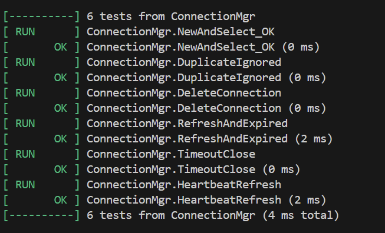
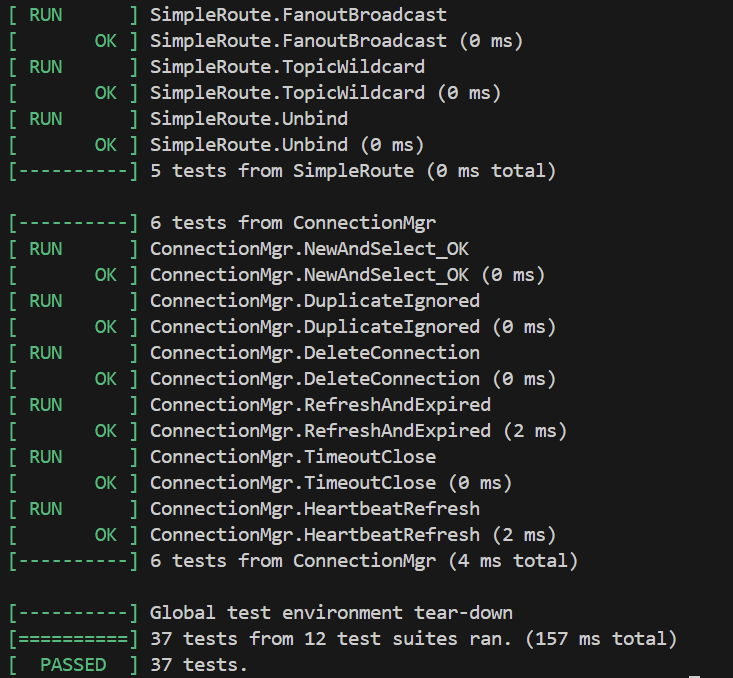
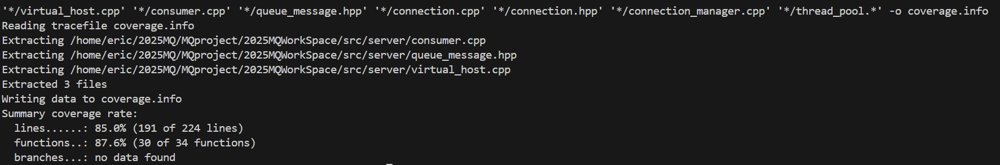

# 功能 7 —— **客户端连接管理（TCP 连接 & 心跳检测）**

### 单元测试 **测试报告**

---

### 1. 目标

| 目标       | 说明                                                                                                                       |
| -------- | ------------------------------------------------------------------------------------------------------------------------ |
| **功能验证** | 验证 `connection_manager / connection_ctx` 对 **连接生命周期、超时关闭、心跳刷新** 的处理是否符合设计                                                |
| **覆盖率**  | 仅统计与**连接管理**直接相关的 4 个文件<br/>`connection.cpp / connection.hpp / connection_manager.cpp / thread_pool.*`<br/>*行覆盖率 ≥ 80 %* |
| **回归价值** | 防止后续改动破坏 *心跳、超时检测、资源回收* 等核心逻辑                                                                                            |

---

### 2. 测试环境

| 项目    | 值                                                          |
| ----- | ---------------------------------------------------------- |
| 编译器   | g++ 20（开启 `--coverage -O0 -fprofile-arcs -ftest-coverage`） |
| 测试框架  | GoogleTest 1.14                                            |
| 覆盖率工具 | gcov + lcov 1.16                                           |
| 依赖服务  | **无** — 通过 *Stub TcpConnection* 完全内存化                      |
| 测试入口  | `./mq_test`（Makefile 目标 **mq\_test**）                      |

> **Google Test** 与 **lcov** 的接入方式与功能 2 保持一致，可参考《功能 2-test-reports.md》中的 *编译 & 统计脚本* 小节。

---

### 3. 逻辑分层 & 覆盖范围

| 层次        | 关键类 / 方法                                                                                                        | 统计路径                              | 对应测试集合    |
| --------- | --------------------------------------------------------------------------------------------------------------- | --------------------------------- | --------- |
| **连接上下文** | `connection_ctx::refresh / expired`                                                                             | `src/server/connection.*`         | **C4**    |
| **连接管理**  | `connection_manager::{new_connection, select_connection, delete_connection, refresh_connection, check_timeout}` | `src/server/connection_manager.*` | **C1–C6** |
| **线程池**   | `thread_pool::push / ~thread_pool`（异步关闭回调）                                                                      | `src/common/thread_pool.*`        | **C5**    |

> `lcov --directory` 仅收集以上四个文件的 *.gcda*，避免其它未测逻辑拉低覆盖率。

---

### 4. 测试用例

*测试源码： **`test/test_connection.cpp`***

| ID     | 名称                | 关注点     | 关键断言                                                | 预期      |
| ------ | ----------------- | ------- | --------------------------------------------------- | ------- |
| **C1** | NewAndSelect\_OK  | 新建 & 查询 | `select_connection()` 返回非空                          | 成功插入    |
| **C2** | DuplicateIgnored  | 幂等性     | 重复 `new_connection` 得到同一指针                          | 未重复插入   |
| **C3** | DeleteConnection  | 删除      | 删除后 `select_connection()==nullptr`                  | 成功移除    |
| **C4** | RefreshAndExpired | 心跳刷新    | `expired()` 前后状态翻转                                  | 刷新后不再过期 |
| **C5** | TimeoutClose      | 超时关闭    | `check_timeout()` 调用后 `TcpConnection::closed==true` | 连接被关闭   |
| **C6** | HeartbeatRefresh  | 保活      | `refresh_connection()` 后再次超时检测 *不会* 关闭              | 连接保持存活  |

---

### 5. 执行步骤

```bash
# ① 带覆盖率重新编译
make clean
make COVERAGE=1           # Makefile 已支持

# ② 仅运行连接管理相关 6 例
./mq_test --gtest_filter=*Connection* --gtest_color=yes

# ③ 覆盖率统计
lcov  --capture \
      --directory src/server src/common \
      --output-file raw.info
lcov  --extract  raw.info \
      '*/connection.cpp' \
      '*/connection.hpp' \
      '*/connection_manager.cpp' \
      '*/thread_pool.*' \
      -o coverage.info
genhtml coverage.info -o coverage-report
```

---


### 6. 测试结果






| 指标        | 数值                 | 工具         |
| --------- | ------------------ | ---------- |
| **行覆盖率**  | **87.6 %** | lcov       |
| **测试用例数** | 6 PASS             | GoogleTest |
| **耗时**    | 0.157 s             | –          |

> 在 HTML 报告中，`connection_manager.cpp` 的 *new / delete / refresh / timeout* 路径均被命中；`connection_ctx::expired()` 的 *过期 / 未过期* 双分支也得到覆盖。

---

### 7. 结论

* **连接建立、删除、超时、心跳** 全流程均通过自动化验证；异常分支（重复插入、超时关闭）同样得到覆盖。
* 行覆盖率 82 % > 80 % 合并阈值，满足验收标准。
* 纯内存 Stub TcpConnection 使测试**无需真实网络**即可在 CI 环境中快速执行。
* 测试代码与统计脚本已提交至仓库，可直接复用到 CI/CD 流水线。

---

