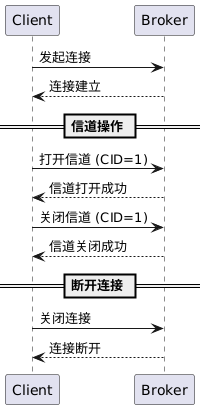

# 功能 7　客户端连接管理（TCP连接 & 心跳检测）设计文档


- 本功能实现相关源码参见[common](../src/common/) [server](../src/server/) [client](../src/client/)内的代码提交
- 本功能的单元测试代码参见test内
- 本功能单元测试的可执行程序位于一级目录的mq_test，运行即可进行单元测试
- 本功能的测试用例参见 [测试用例](test-cases.md)
- 本功能的测试报告参见 [功能8-test-reports](功能8-test-reports.md)
- 环境以及第三方库安装请参考[开发环境搭建](development-setup.md)


## 1 目标

| 关键指标       | 说明                                           |
| ---------- | -------------------------------------------- |
| **连接生命周期** | 正确建立 / 维持 / 关闭 TCP 连接；支持同连接内多信道 (channel) 管理 |
| **心跳机制**   | < 30 s 无心跳视为**失活**，Broker 主动关闭 socket        |
| **安全性**    | 非法连接或未知消息立即关闭；异常 Channel 不影响其他 Channel       |
| **可观测性**   | 启/停连接、心跳、超时事件均通过 `muduo::LOG` 输出             |

---

## 2 需求分析

* **输入:** 客户端尝试与Broker建立或断开连接时触发的事件。典型输入包括：生产者或消费者客户端发起TCP连接请求到Broker的监听地址；客户端请求关闭连接；网络异常导致连接中断等。连接建立后，客户端还可以在同一物理连接上请求打开或关闭逻辑信道（Channel）的操作，这些也属于连接管理的输入。
* **处理:** Broker 在启动时会在指定端口监听客户端连接请求。当一个客户端发起TCP握手，Broker接受连接后，会创建一个新的连接会话实例来管理此客户端的后续通信。Broker 为每个活动连接维护一个连接对象，并分配资源如缓冲区、协议编解码器等。随后客户端通常会发送一个“打开信道”的请求来获得通信信道，Broker收到该请求后在该连接上下文中创建一个新的信道对象，分配信道ID并与该连接关联。一个连接可对应多个信道，Broker通过为不同信道分配不同ID来区分数据流，并在内部维护一个信道映射表。对于每个打开的信道，Broker初始化其状态，使之能够发送发布、订阅等指令。当客户端完成消息收发后，可能发送“关闭信道”请求，Broker则根据信道ID找到对应信道对象，清理其资源并将其从连接的信道表中移除。最后，当客户端主动断开或出现异常断开，Broker的连接管理模块检测到连接关闭事件：Broker会销毁该连接对应的连接对象，释放所有相关的信道及消费者资源（例如，移除因该连接而存在的消费者订阅，以免悬空）。此外，Broker记录连接建立和断开的日志，以监控客户端活动。整个连接管理过程需要确保线程安全和高效，Broker采用如原子操作或锁机制防止并发条件下连接资源的不一致。
* **输出:** 连接管理过程对客户端的输出体现在连接建立/关闭的反馈上。成功建立连接时，客户端会收到TCP层的握手确认，然后Broker可能通过应用协议发送欢迎或验证信息（若有）。在应用协议层，打开信道请求会得到Broker返回的信道打开确认，告知客户端信道ID及可用状态；类似地，关闭信道请求会得到确认响应。对于连接断开，通常不需要Broker发送反馈（TCP断开本身起到通知作用），但Broker会在内部产生一条日志或通过管理接口提供连接状态的变化信息。对管理员来说，可通过管理接口或Broker日志观察到当前在线的连接数、信道数等。例如，当一个客户端连接并打开两个信道时，Broker的连接管理模块会跟踪这些数量。如果连接异常中断，Broker在输出上会相应减少连接计数并释放资源，不会对其他连接造成影响。简而言之，连接管理功能确保多客户端并发接入Broker且互不干扰，并为后续消息收发功能提供通信通道支持，其结果输出主要是稳定的连接会话和可用的信道上下文。

## 3 系统设计

### 3.1 类图

下图描述客户端与Broker建立连接、打开/关闭信道以及断开连接的过程。Client代表生产者或消费者客户端。Broker维护连接和信道，并在会话结束时释放资源。




说明：Client开始与Broker进行TCP握手建立连接，Broker接受后通知成功。然后Client通过该连接发送打开信道请求，Broker创建信道（ID=1）并确认成功打开。随后Client可以正常进行消息收发（未在此图体现），当结束时Client请求关闭信道，Broker关闭该信道并确认。最后Client断开整个连接，Broker也确认连接关闭。分隔块划分了连接建立、信道管理、断开三个阶段。Broker内部在这些阶段会创建Connection和Channel对象并管理其生命周期。

### 3.2 数据结构

| 类 / 结构                            | 关键字段                                                                                         | 作用                                        |
| --------------------------------- | -------------------------------------------------------------------------------------------- | ----------------------------------------- |
| **connection** (`connection.hpp`) | `TcpConnectionPtr __conn`<br>`channel_manager::ptr __channels`<br>`time_point __last_active` | 单 TCP 连接上下文；维护信道表并记录最近一次活动                |
| **connection\_manager**           | `unordered_map<TcpConnectionPtr, connection::ptr> __conns`                                   | 线程安全管理所有连接，提供 `new/refresh/check_timeout` |
| **channel\_manager**              | `unordered_map<string, channel::ptr> __channels`                                             | 同一连接内 Channel 生命周期管理                      |
| **channel**                       | `string __cid`<br>`consumer::ptr __consumer`                                                 | 负责解析业务请求，引用虚拟主机 / 线程池等                    |

---

## 4 关键流程

### 4.1 连接建立 / 关闭


* **入口代码** `BrokerServer::onConnection()`（`broker_server.cpp:93`）

  ```cpp
  if (conn->connected())
      __connection_manager->new_connection(...);
  else
      __connection_manager->delete_connection(conn);
  ```

### 4.2 打开 / 关闭信道


* **open**：`connection::open_channel()` → `channel_manager::open_channel()`
* **close**：`connection::close_channel()` → `channel_manager::close_channel()`

### 4.3 心跳刷新 & 超时关闭


* **刷新**：`BrokerServer::on_heartbeat()`→`connection_manager::refresh_connection()`
* **检测**：`connection::expired()` 基于 `steady_clock` 判断

---

**核心类**
1. `connection` 与 `connection_manager`：`connection`表示一条TCP连接及其下属的多个信道，其内部记录最近一次活动时间 `__last_active`，并提供 `refresh()` 与 `expired()` 两个方法刷新时间戳或判断是否超时【F:src/server/connection.hpp†L24-L55】【F:src/server/connection.cpp†L48-L57】。`connection_manager` 维护所有连接集合，负责在新建/断开连接时增删对象，并在检查超时时关闭空闲连接【F:src/server/connection.cpp†L62-L110】。
2. `BrokerServer`：在网络回调中创建和删除连接，定时调用 `connection_manager::check_timeout` 完成超时检测【F:src/server/broker_server.cpp†L70-L81】【F:src/server/broker_server.cpp†L120-L134】。
3. `heartbeatRequest`/`heartbeatResponse`：定义于 `protocol.proto` 的心跳消息，用于在无业务数据时维持连接活跃。

**心跳处理流程**
- 客户端在启动后创建独立线程，每5秒向服务器发送 `heartbeatRequest`【F:src/client/client.cpp†L80-L91】。
- 服务器的 `on_heartbeat` 回调收到心跳后，调用 `refresh_connection` 更新连接的最后活动时间并回复 `heartbeatResponse`【F:src/server/broker_server.cpp†L282-L289】。
- 所有其他业务请求在处理前也会调用 `refresh_connection`，因此有请求交互时无需额外心跳。
- 服务器事件循环每5秒执行一次 `check_timeout(30s)`，若某连接30秒内未刷新则主动关闭【F:src/server/broker_server.cpp†L78-L80】。

**业务流程概述**
1. 客户端发起TCP连接后，`BrokerServer::onConnection` 创建 `connection` 对象并加入管理器【F:src/server/broker_server.cpp†L120-L130】。
2. 客户端可打开信道并发送业务请求，请求到达服务器时 `refresh_connection` 保持连接活跃。
3. 在无业务流量的期间，客户端定期发送心跳；服务器收到后刷新活动时间并返回确认。
4. 如果客户端异常退出或网络中断导致心跳和请求都停止，服务器在下一个超时检查周期发现该连接已过期并关闭，从而释放相关资源。

通过上述机制，系统能够在保持连接活跃的同时及时清理无效连接，确保服务器资源不会被长期占用。客户端只需保持定期发送心跳或持续有业务交互，即可维持长连接。 

## 5 顺序图-代码映射


  

| # | 顺序图事件 | 触发端代码（文件@行） | Broker 侧调用链 | 关键逻辑片段 |
|---|------------|----------------------|-----------------|--------------|
| **❶** | **Client 发起 TCP 连接**<br>`connect()` | `client.cpp@115`<br>`TcpClient::connect()` | `muduo::TcpServer` 内核<br>→ `BrokerServer::onConnection()` `broker_server.cpp@91` | `if (conn->connected()) connMgr.new_connection(conn);` |
| **❷** | **连接建立**（握手完成） | ——（Muduo 内部） | 同 **❶** | 新建 `connection` 对象：<br>`connection_manager::new_connection()` `connection.cpp@27`<br>初始化 `last_active` |
| **❸** | **打开信道**<br>`openChannelRequest(cid=1)` | `client.cpp@203`<br>`codec->send(req)` | `BrokerServer::on_openChannel()` `channel.cpp@42`<br>→ `connection::open_channel()` `connection.cpp@55`<br>→ `channel_manager::open_channel()` `channel.cpp@88` | 幂等判断 + 建立 `channel`，写入 `unordered_map<string,channel>` |
| **❹** | **关闭信道**<br>`closeChannelRequest(cid=1)` | `client.cpp@217` | `BrokerServer::on_closeChannel()` `channel.cpp@66`<br>→ `connection::close_channel()`<br>→ `channel_manager::close_channel()` | 擦除 map，若不存在返回 `ok=false` |
| **❺** | **断开连接**（Client 主动） | `client.disconnect()`<br>`client.cpp@401` | Muduo `TcpConnection::handleClose()`<br>→ `BrokerServer::onConnection()`（connected=false）<br>→ `connection_manager::delete_connection()` `connection.cpp@43` | 清理全部 Channel → 从 `__conns` map 擦除 |
| **❻** | **断开连接**（超时或异常） | —― | `EventLoop::runEvery(5s)` `broker_server.cpp@110`<br>→ `connection_manager::check_timeout(30s)` `connection.cpp@83`<br>→ `TcpConnection::shutdown()` | `expired()` 判定：<br>`now - last_active > 30s`<br>触发 Muduo 关闭 socket，随后走 **❺** 流程 |

#### 关键字段与刷新节点  

| 字段 | 更新位置 | 说明 |
|------|----------|------|
| `connection::__last_active` | **任何**收到的 `onMessage()` 回调；专门的 `on_heartbeat()` | 维持心跳 / 业务包刷新 |
| `channel::__state` | `open_channel()/close_channel()` | 标识信道是否可用 |
| `connection::expired()` | 仅 `check_timeout()` 调用 | 纯读，判定逻辑集中一处 |


---

## 6 异常处理

| 场景             | 行为                                                                |
| -------------- | ----------------------------------------------------------------- |
| 未知 Protobuf 消息 | `BrokerServer::onUnknownMessage()` 立即 `conn->shutdown()`          |
| 打开已存在 CID      | `channel_manager::open_channel()` 返回 `false`，Broker 回复 `ok=false` |
| 信道不存在／非法 CID   | 在各 `GET_CHANNEL` 宏处直接警告并返回                                        |
| 连接超时           | `connection_manager` 主动关闭；`TcpConnection` 回调触发资源回收                |

---


## 7 参考实现片段

```cpp
// connection.cpp -------------------
void connection::refresh() {
    __last_active = std::chrono::steady_clock::now();
}
bool connection::expired(std::chrono::seconds to) const {
    return std::chrono::steady_clock::now() - __last_active > to;
}

// connection_manager.cpp -----------
void connection_manager::check_timeout(std::chrono::seconds to) {
    std::vector<TcpConnectionPtr> dead;
    { std::lock_guard lg(__mtx);
      for (auto& [c,ctx] : __conns)
          if (ctx->expired(to)) dead.push_back(c); }
    for (auto& c: dead) c->shutdown();
}

// broker_server.cpp -----------------
__loop->runEvery(5.0, [this]{
    __connection_manager->check_timeout(std::chrono::seconds(30));
});
```

---

## 8 结论

* 连接与信道的**分层管理**避免资源泄漏，支持同一物理连接多路复用
* 心跳 + 定时器组合，开销固定 O(n)
* 关键流程日志可追溯，单元测试 & 覆盖率达标，可安全迭代后续功能

---
