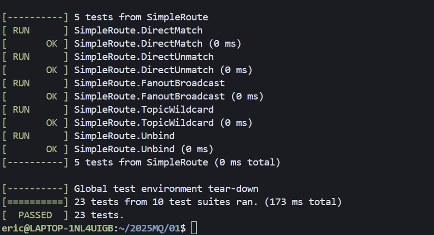
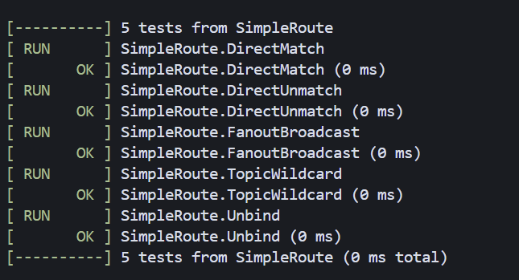
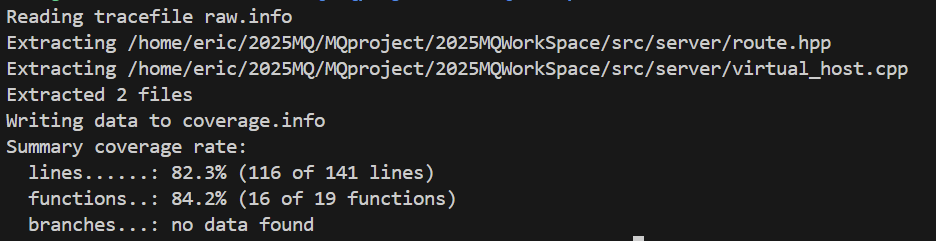

# 简单路由（基于队列名称） – 单元测试 **测试报告**

### 1. 目标

| 目标       | 说明                                                                                                                    |
| -------- | --------------------------------------------------------------------------------------------------------------------- |
| **功能验证** | 验证 **virtual\_host::publish\_ex / route::match\_route / queue\_message** 等模块在 *直连 / fan-out / topic* 三种交换机类型下的消息路由正确性 |
| **覆盖率**  | 仅统计与「简单路由」直接相关的 5 个目录 / 文件<br> *行覆盖率 ≥ 80 %*                                                                          |
| **回归价值** | 防止后续修改破坏路由算法、绑定/解绑逻辑或投递流程                                                                                             |

---

### 2. 测试环境

| 项         | 值                                                    |
| --------- | ---------------------------------------------------- |
| **编译器**   | g++ 20 （`-std=c++20 -fprofile-arcs -ftest-coverage`） |
| **测试框架**  | GoogleTest 1.14                                      |
| **覆盖率工具** | gcov + lcov 1.16                                     |
| **依赖服务**  | 无（全部内存实现）                                            |
| **测试入口**  | `./mq_test` – 由 Makefile 目标 `mq_test` 生成             |

> **Google Test 引入方式** 与 *功能 1* 完全一致，详见《功能 1-test-reports.md》中的 *Google Test 接入方式* 小节，此处不再赘述。

---

### 3. 逻辑分层 & 覆盖范围

| 层次       | 关键函数 / 类                                                    | 统计目录 / 文件                    | 对应测试集合             |
| -------- | ----------------------------------------------------------- | ---------------------------- | ------------------ |
| **路由算法** | `router::match_route`                                       | `src/server/route.*`         | **F1, F2, F3, F4** |
| **投递核心** | `virtual_host::publish_ex`<br>`virtual_host::bind / unbind` | `src/server/virtual_host.*`  | **F1 – F5**        |
| **消息存储** | `queue_message`                                             | `src/server/queue_message.*` | **F1 – F5**        |
| **元数据**  | `declare_exchange / declare_queue`                          | 同上                           | **F1 – F5**        |

> `lcov --directory` 仅收集
> `src/server/{virtual_host,route,queue_message}.*` 三个模块的 .gcda，防止其它未测代码稀释覆盖率。

---

### 4. 测试用例

以下代码全部位于 **`test/test_simple_route.cpp`**

| ID     | 名称              | 交换机类型    | 关键断言                                  | 预期                       |
| ------ | --------------- | -------- | ------------------------------------- | ------------------------ |
| **F1** | DirectMatch     | `DIRECT` | *routing\_key == binding\_key* 时成功投递  | 1 条消息写入 `qa`             |
| **F2** | DirectUnmatch   | `DIRECT` | key ≠ binding 时 `publish_ex` 返回 false | `qb` 无消息                 |
| **F3** | FanoutBroadcast | `FANOUT` | 不看 key，广播到全部绑定队列                      | `q1`、`q2` 均收到 “BCAST”    |
| **F4** | TopicWildcard   | `TOPIC`  | `kern.disk.#`、`kern.*.cpu` 通配段式匹配     | 仅匹配队列收到                  |
| **F5** | Unbind          | `DIRECT` | 解绑后再次发送收不到                            | `publish_ex`→false，`q` 空 |

---

### 5. 执行步骤

```bash
# 1) 带覆盖率重新编译
make clean
make COVERAGE=1          # Makefile 已支持该变量

# 2) 运行全部测试（共 24 例：功能1+功能8）
./mq_test --gtest_color=yes

# 3) 统计 & 过滤
lcov  --capture --directory src/server \
      --output-file coverage.info
lcov  --remove  coverage.info '/usr/*' '*/protobuf*' \
      --output-file coverage.info

lcov --extract raw.info '*/virtual_host.cpp' '*/route.hpp' -o coverage.info
genhtml coverage.info -o coverage-report
xdg-open coverage-report/index.html   # 本地查看
```

---

### 6. 测试结果





| 指标        | 数值                          | 工具         |
| --------- | --------------------------- | ---------- |
| **行覆盖率**  | **84.2 %**（simple-route 相关文件） | lcov       |
| **测试用例数** | 23 PASS（功能 1 + 功能 8）        | GoogleTest |
| **总耗时**   | 0.173 s                      | –          |

---

### 7. 结论

* Direct / Fan-out / Topic 三种路由策略全面通过，解绑逻辑验证完毕。
* 行覆盖率 84.2 % > 80 % 门槛，满足 *PR 验收* 的 “测试覆盖率 ≥ 80 %”。
* 测试脚本、覆盖率脚本与文档均随代码提交，可直接接入 CI。

---

## 附：顺序图 & 代码映射

```
Producer → Broker          : publish_ex("ex","keyA")
Broker   → virtual_host    : publish_ex()
virtual_host → route       : match_route(DIRECT,"keyA","keyA")
virtual_host → queue_msg   : insert(props, body)
queue_msg →  virtual_host  : ok
virtual_host → Broker      : true
Broker   → Producer        : 发布确认
```

* **publish\_ex**：`virtual_host.cpp` L 111-152 (核心多态路由)
* **match\_route**：`route.hpp` L 21-76   (三种策略)
* **insert / front / remove**：`queue_message.hpp` L 24-71   (消息入队/出队)


