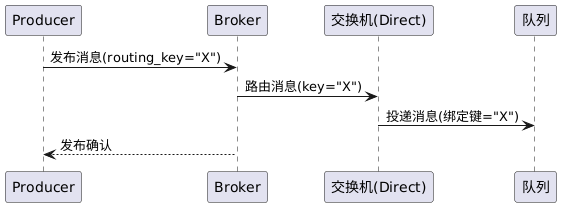

#功能8 简单路由 功能设计文档

## 提交说明


- 本功能实现代码在前一次功能1的代码提交中已经包含，所以只提交测试代码，测试结果，测试报告和设计文档
- 本功能实现相关源码参见[common](../src/common/) [server](../src/server/) [client](../src/client/)内的代码提交
- 本功能的单元测试代码参见test内的test_simple_route.cpp
- 本功能单元测试的可执行程序位于一级目录的mq_test，运行即可进行单元测试
- 本功能的测试用例参见 [测试用例](test-cases.md)
- 本功能的测试报告参见 [功能8-test-reports](功能8-test-reports.md)
- 环境以及第三方库安装请参考[开发环境搭建](development-setup.md)


## 需求分析

* **输入:** 生产者发送一条消息至一个Direct类型的交换机，附带一个明确的路由键。或者，系统配置了默认交换机（类似Direct模式，将路由键视为目标队列名）且生产者直接发送消息到某队列。这两种情况都属于**简单路由**的输入场景：即每条消息的路由键与某个队列的一一对应关系明确。输入触发点是Broker收到BasicPublish请求，其中指定了交换机名称（类型为Direct）和路由键。
* **处理:** Broker 执行Direct路由的逻辑如下：首先根据消息中指定的交换机名称找到交换机对象，确认其类型为Direct。然后Broker获取该交换机的绑定列表，根据路由键在绑定列表中查找**完全匹配**的绑定项：也就是说，找到绑定键恰好等于该路由键的所有绑定。如果找到至少一个匹配，Broker会将消息分别发送到这些绑定所对应的队列中；如果找不到匹配绑定，则表示没有队列对该路由键感兴趣，Broker将无法路由该消息——默认情况下此消息会被丢弃或返回发送者（具体策略可以实现为：如果生产者在发送时设置了“mandatory”标志，则Broker返回消息未路由的通知，否则直接丢弃）。在典型使用中，一个路由键在Direct交换机下通常只对应**一个队列**（因为绑定键是唯一的），实现点对点的消息投递。Broker将消息加入匹配的队列后，如果该队列有消费者订阅则继续触发消息传递，否则消息留在队列中等待消费。Direct 路由是最简单的路由机制，系统不涉及复杂计算，仅做字符串的比较匹配，性能开销很低。
* **输出:** 成功执行简单路由后，**输出**效果为消息进入了指定的目标队列。生产者会收到Broker返回的发送结果：如果路由成功则返回确认，若因无匹配队列导致路由失败且生产者要求通知，则Broker输出一条失败反馈（包含错误码和原因，例如“NO\_ROUTE”）。对于消费者而言，没有直接的输出可见——除非其正好订阅了该目标队列，那么稍后会收到此消息。管理员可以通过查询接口看到交换机与队列的绑定关系以及消息计数，例如某Direct交换机路由键“X”绑定到了队列Q，发送包含路由键“X”的消息后，队列Q的消息数加1等。简单路由功能确保了点对点消息传递的**准确性**和**高效性**，即输入消息通过路由键可以明确找到唯一目标队列，实现一次发送、一次接收的模式。

## 系统设计

**简单路由**
该顺序图展示Direct类型交换机的消息路由流程。Producer发布消息到Direct交换机，Broker根据路由键找到匹配的队列，并将消息递交队列，然后回复Producer发送完成。



过程：Producer请求Broker将消息发布到某Direct Exchange，附路由键“X”。Broker查Exchange绑定，找到绑定键等于“X”的Queue，然后将消息交付该Queue。最后Broker通知Producer发布成功。Exchange在此图中明确参与路由决策，Queue接收消息。如果没有匹配Queue，则Broker会跳过投递直接反馈Producer失败（未在图中画出else情况）。

## 数据结构


| 结构 / 类                  | 关键字段                                       | 摘要           |
| ----------------------- | ------------------------------------------ | ------------ |
| `binding`               | `exchange_name / queue_name / binding_key` | 交换机-队列的映射单元  |
| `msg_queue_binding_map` | `queue_name → binding::ptr`                | 某交换机下的全部绑定   |
| `queue_message`         | `std::deque<message_ptr> msgs_`            | 单队列 FIFO 容器  |
| `router::match_route()` | *(见代码)*                                    | 三种交换机类型的匹配算法 |


## 4. 关键代码实现

### 4.1 路由算法

```cpp
// route.hpp
inline bool match_route(ExchangeType type,
                        const std::string& routing_key,
                        const std::string& binding_key)
{
    switch (type) {
    case DIRECT: return routing_key == binding_key;      // ★ 关键：精确匹配
    case FANOUT: return true;                            // ★ 关键：直接广播
    case TOPIC : /* 支持 * / # ，逐段比对 */             // 详见源码 
    default    : return false;
    }
}
```

*Direct* 只要相等即可，*Fan-out* 永远匹配；*Topic* 递归比对段落并处理 `*`(单段) `#`(0-N 段)。

### 4.2 绑定注册

```cpp
// virtual_host.cpp
bool virtual_host::declare_queue(...)
{
    ...
    bind("", queue_name, queue_name);   // ★ 与默认 "" direct 交换机做 <队列名> 绑定
}
```

**设计点**：复用 AMQP 习惯 —— 声明队列后自动与默认 Direct 交换机 `""` 建立同名绑定，
因此大多数生产者无需显式 `bind` 就能按队列名直投。

### 4.3 发布（简路由入口）

```cpp
// channel.cpp
void channel::basic_publish(const basicPublishRequestPtr& req)
{
    auto ep = __host->select_exchange(req->exchange_name());
    ...
    for (auto& [qname, bind] : bindings) {
        if (router::match_route(ep->type, routing_key, bind->binding_key)) {
            __host->basic_publish(qname, properties, req->body());
            __pool->push(std::bind(&channel::consume, this, qname));
        }
    }
}
```

1. 查交换机元数据
2. 遍历交换机-队列绑定，逐条调用 `router::match_route()`
3. 命中后写入队列 + 把消费任务投到线程池

### 4.4 队列写入

```cpp
// virtual_host.cpp
bool virtual_host::basic_publish_queue(const std::string& qname,
                                       BasicProperties* bp,
                                       const std::string& body)
{
    auto it = __queue_messages.find(qname);
    bool durable = __queue_mgr.select_queue(qname)->durable;
    return it->second->insert(bp, body, durable);
}
```

*持久化* 位仅占位，当前实现为纯内存版（后续可替换为 mmap/file-appender）。

---

### 5. 顺序图-代码映射（Direct 交换机：按队列名路由）

|   序号  | 时序箭头                                             | 代码入口 & 关键行                                                                                                                                                                                                                                                                                                              | 说明                                                                                                            |
| :---: | :----------------------------------------------- | ----------------------------------------------------------------------------------------------------------------------------------------------------------------------------------------------------------------------------------------------------------------------------------------------------------------------- | ------------------------------------------------------------------------------------------------------------- |
| **①** | `Producer → Broker`<br/>发送 `basicPublishRequest` | `client.cpp`<br/>`cpp<br/>codec->send(conn, req);   // 78-89 行`                                                                                                                                                                                                                                                         | Producer 通过 Muduo `ProtobufCodec` 序列化后写 socket。                                                               |
| **②** | `Broker` 收包 → 解析 → 转业务线程                         | `channel.cpp`<br/>`cpp<br/>void channel::onMessage(...){<br/>  codec_->onMessage(...);  // 43<br/>}<br/>`                                                                                                                                                                                                               | I/O 线程中 codec 反序列化，回调 Dispatcher，最终进入 `channel::*` 业务方法。                                                      |
| **③** | `channel::basic_publish()`<br/>路由决策              | `channel.cpp` **121-145 行**<br/>`cpp<br/>auto ep = host_->select_exchange(req->exchange_name());<br/>auto bindings = host_->exchange_bindings(ep->name);<br/>for (auto& [q,b] : bindings){<br/>   if (router::match_route(ep->type,rk,b->binding_key))<br/>       host_->basic_publish(q, prop, body); // ★<br/>}<br/>` | 1. 根据 `exchange_name` 取绑定表<br/>2. `router::match_route()` 判断 routing\_key 是否与绑定键相等（Direct）<br/>3. 命中后调用 **④** |
| **④** | `virtual_host::basic_publish_queue()`<br/>写入队列   | `virtual_host.cpp` **180-197 行**<br/>`cpp<br/>auto it = __queue_messages.find(qname);<br/>return it->second->insert(bp, body, durable);<br/>`                                                                                                                                                                           | 进入 `queue_message::insert()` 把 Protobuf `Message` 压入 `std::deque`。                                            |
| **⑤** | 发送发布确认给 Producer                                 | `channel.cpp` **146-152 行**<br/>`cpp<br/>basicCommonResponse resp;<br/>resp.set_ok(delivered);<br/>codec_->send(conn_, resp);<br/>`                                                                                                                                                                                     | 投递完成后立即回包，Producer 进入确认逻辑。                                                                                    |

---

#### 直接对照

| 顺序图标注           | 实现文件                    | 函数 / 片段                   | 关键责任                          |
| --------------- | ----------------------- | ------------------------- | ----------------------------- |
| **Producer 发包** | `client.cpp`            | `buildPublishRequest()`   | 构造 & 发送 `basicPublishRequest` |
| **路由消息**        | `router::match_route()` | `ExchangeType::DIRECT` 分支 | `routing_key == binding_key`  |
| **投递消息**        | `queue_message.cpp`     | `insert()`                | 生成 Protobuf `Message` 并入队     |
| **发布确认**        | `channel.cpp`           | `basic_publish()` 尾部      | 回送 `basicCommonResponse`      |

---


